# KNOWLEDGE_GRAPH.md

> **Generated reference document.** This file maps the *conceptual dependency
> structure* of Trading-Academy-Pro — every lesson, what it requires, what it
> connects to, and what it misleads students into believing if skipped or
> misread. Generated from the actual `## Prerequisites`, `## Next Lesson`,
> and `## Misconceptions` sections of all 270 lessons on 2026-08-05.

## How This Differs From the Other Root Documents

| Document | Question it answers |
|---|---|
| `LEARNING_PATH.md` | "What order should I read things in?" (one recommended path) |
| `CURRICULUM.md` | "What is planned to exist?" (the syllabus, source of truth for scope) |
| `INDEX.md` | "Where is everything, and how long/hard is it?" (flat table of contents) |
| **`KNOWLEDGE_GRAPH.md`** | **"What depends on what, and what do people get wrong?"** (the concept graph) |

Unlike `LEARNING_PATH.md`'s single linear path, this file is a **graph, not a
line** — many lessons have multiple prerequisites, feed multiple downstream
topics, and connect sideways to lessons in other modules. Read it when you
want to know *why* a lesson is where it is, not just *that* it is there.

## How to Read Each Entry

For every one of the 270 core lessons (Modules 01–31), this file lists:

- **Prerequisites** — lessons you must understand first. Sourced directly
  from that lesson's own `## Prerequisites` section.
- **Related Topics** — lessons the material itself cross-references or sits
  conceptually beside, without being strictly required either direction.
- **Next Topic** — the single recommended next lesson (from that lesson's
  own `## Next Lesson` section). This is `LEARNING_PATH.md`'s path,
  one step at a time.
- **Advanced Topics** — later lessons (beyond the immediate next one) that
  build on this concept. Computed by reversing the prerequisite graph: if
  lesson X lists this lesson as a prerequisite, X appears here (up to 3,
  excluding whatever is already the Next Topic).
- **Key Misconception** — the first belief that lesson's own
  `## Misconceptions` section corrects, compressed to one line. See the
  lesson itself for the full explanation of *why* it's wrong.

In each Mermaid diagram, a **square box** (`[...]`) is a lesson in that
module; a **rounded/stadium box** (`(...)`) is a lesson from a *different*
module that this module's lessons depend on — its label always includes
which module it belongs to (e.g. "01.01 · Mod 01"). An arrow `A --> B`
means "A is a prerequisite of B."

## Table of Contents

- [Master Concept Graph](#master-concept-graph)
- [Module 01 — Foundation](#module-01-foundation)
- [Module 02 — Market Structure](#module-02-market-structure)
- [Module 03 — Indian Market](#module-03-indian-market)
- [Module 04 — Global Market](#module-04-global-market)
- [Module 05 — Economics](#module-05-economics)
- [Module 06 — Macroeconomics](#module-06-macroeconomics)
- [Module 07 — Financial Statements](#module-07-financial-statements)
- [Module 08 — Fundamental Analysis](#module-08-fundamental-analysis)
- [Module 09 — Valuation](#module-09-valuation)
- [Module 10 — Technical Analysis](#module-10-technical-analysis)
- [Module 11 — Candlesticks](#module-11-candlesticks)
- [Module 12 — Chart Patterns](#module-12-chart-patterns)
- [Module 13 — Price Action](#module-13-price-action)
- [Module 14 — Volume](#module-14-volume)
- [Module 15 — Market Profile](#module-15-market-profile)
- [Module 16 — Volume Profile](#module-16-volume-profile)
- [Module 17 — Wyckoff](#module-17-wyckoff)
- [Module 18 — Smart Money](#module-18-smart-money)
- [Module 19 — ICT](#module-19-ict)
- [Module 20 — Futures](#module-20-futures)
- [Module 21 — Options](#module-21-options)
- [Module 22 — Greeks](#module-22-greeks)
- [Module 23 — Volatility](#module-23-volatility)
- [Module 24 — Trading Strategies](#module-24-trading-strategies)
- [Module 25 — Risk Management](#module-25-risk-management)
- [Module 26 — Position Sizing](#module-26-position-sizing)
- [Module 27 — Portfolio Management](#module-27-portfolio-management)
- [Module 28 — Trading Psychology](#module-28-trading-psychology)
- [Module 29 — Algorithmic Trading](#module-29-algorithmic-trading)
- [Module 30 — Quantitative Trading](#module-30-quantitative-trading)
- [Module 31 — Case Studies](#module-31-case-studies)
- [Modules 32–40 — The Support Layer](#modules-3240--the-support-layer)
- [Recurring Threads](#recurring-threads)

## Master Concept Graph

This is the curriculum at module granularity: an arrow from Module A to
Module B means at least one lesson in B lists a lesson in A as a
prerequisite. It is generated from the same prerequisite data as every
per-module diagram below, not hand-drawn — so it reflects what the lessons
actually cite, not just the shelf order in `CURRICULUM.md`.

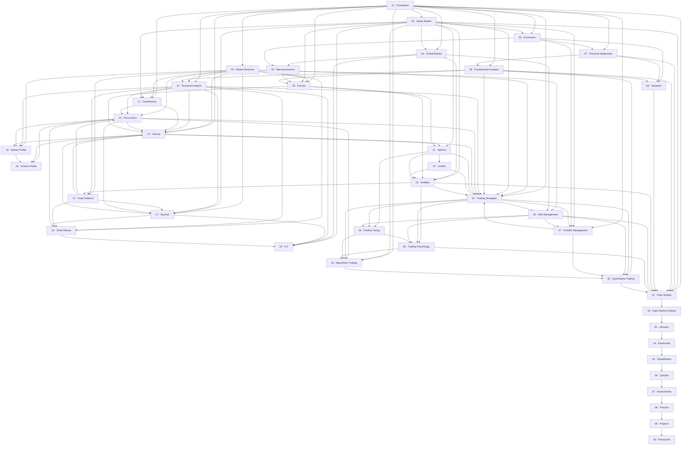
```mermaid
flowchart TD
    M01["01 · Foundation"]
    M02["02 · Market Structure"]
    M03["03 · Indian Market"]
    M04["04 · Global Market"]
    M05["05 · Economics"]
    M06["06 · Macroeconomics"]
    M07["07 · Financial Statements"]
    M08["08 · Fundamental Analysis"]
    M09["09 · Valuation"]
    M10["10 · Technical Analysis"]
    M11["11 · Candlesticks"]
    M12["12 · Chart Patterns"]
    M13["13 · Price Action"]
    M14["14 · Volume"]
    M15["15 · Market Profile"]
    M16["16 · Volume Profile"]
    M17["17 · Wyckoff"]
    M18["18 · Smart Money"]
    M19["19 · ICT"]
    M20["20 · Futures"]
    M21["21 · Options"]
    M22["22 · Greeks"]
    M23["23 · Volatility"]
    M24["24 · Trading Strategies"]
    M25["25 · Risk Management"]
    M26["26 · Position Sizing"]
    M27["27 · Portfolio Management"]
    M28["28 · Trading Psychology"]
    M29["29 · Algorithmic Trading"]
    M30["30 · Quantitative Trading"]
    M31["31 · Case Studies"]
    M01 --> M02
    M01 --> M03
    M01 --> M04
    M01 --> M05
    M01 --> M07
    M01 --> M08
    M01 --> M10
    M01 --> M11
    M01 --> M14
    M01 --> M20
    M01 --> M24
    M01 --> M27
    M01 --> M29
    M01 --> M31
    M02 --> M10
    M02 --> M11
    M02 --> M12
    M02 --> M13
    M02 --> M14
    M02 --> M15
    M02 --> M17
    M02 --> M18
    M02 --> M20
    M02 --> M24
    M02 --> M25
    M03 --> M04
    M03 --> M05
    M03 --> M11
    M03 --> M17
    M03 --> M19
    M03 --> M20
    M03 --> M21
    M03 --> M23
    M03 --> M24
    M03 --> M27
    M03 --> M29
    M03 --> M31
    M04 --> M06
    M04 --> M19
    M04 --> M23
    M04 --> M25
    M05 --> M06
    M05 --> M07
    M05 --> M09
    M05 --> M27
    M06 --> M20
    M07 --> M08
    M07 --> M09
    M07 --> M31
    M08 --> M09
    M08 --> M10
    M08 --> M20
    M08 --> M24
    M08 --> M30
    M08 --> M31
    M09 --> M31
    M10 --> M11
    M10 --> M12
    M10 --> M13
    M10 --> M14
    M10 --> M15
    M10 --> M17
    M10 --> M18
    M10 --> M19
    M10 --> M24
    M11 --> M13
    M11 --> M14
    M12 --> M13
    M12 --> M14
    M12 --> M17
    M12 --> M18
    M13 --> M14
    M13 --> M15
    M13 --> M16
    M13 --> M17
    M13 --> M18
    M13 --> M24
    M13 --> M29
    M14 --> M15
    M14 --> M16
    M14 --> M17
    M14 --> M21
    M14 --> M24
    M15 --> M16
    M17 --> M18
    M17 --> M19
    M18 --> M19
    M20 --> M14
    M20 --> M21
    M20 --> M23
    M21 --> M22
    M21 --> M23
    M21 --> M24
    M21 --> M26
    M22 --> M23
    M22 --> M24
    M23 --> M12
    M23 --> M24
    M23 --> M28
    M23 --> M31
    M24 --> M25
    M24 --> M26
    M24 --> M27
    M24 --> M28
    M24 --> M29
    M24 --> M30
    M25 --> M26
    M25 --> M27
    M25 --> M28
    M25 --> M30
    M25 --> M31
    M26 --> M28
    M26 --> M29
    M27 --> M24
    M27 --> M30
    M28 --> M29
    M28 --> M31
    M29 --> M30
    M30 --> M31
    M32["32 · Daily Market Analysis"]
    M33["33 · Glossary"]
    M34["34 · Flashcards"]
    M35["35 · CheatSheets"]
    M36["36 · Quizzes"]
    M37["37 · Assessments"]
    M38["38 · Practice"]
    M39["39 · Projects"]
    M40["40 · Resources"]
    M31 --> M32
    M32 --> M33
    M33 --> M34
    M34 --> M35
    M35 --> M36
    M36 --> M37
    M37 --> M38
    M38 --> M39
    M39 --> M40
```

Reading this graph: `01_Foundation` is the only module with no inbound
edges — the true root of the curriculum. Everything else depends, directly
or transitively, on it. Modules with many inbound edges (`02_Market_Structure`,
`10_Technical_Analysis`, `25_Risk_Management`) are **hubs** — concepts later
modules keep reaching back for. Modules 32–40 sit downstream of the entire
01–31 block; see [Modules 32–40](#modules-3240--the-support-layer) below for
why they're drawn as a simple chain rather than a lesson-level graph.

---

## Per-Module Concept Graphs (Modules 01–31)

### Module 01 — Foundation

[Module Index](docs/01_Foundation/_Index.md)

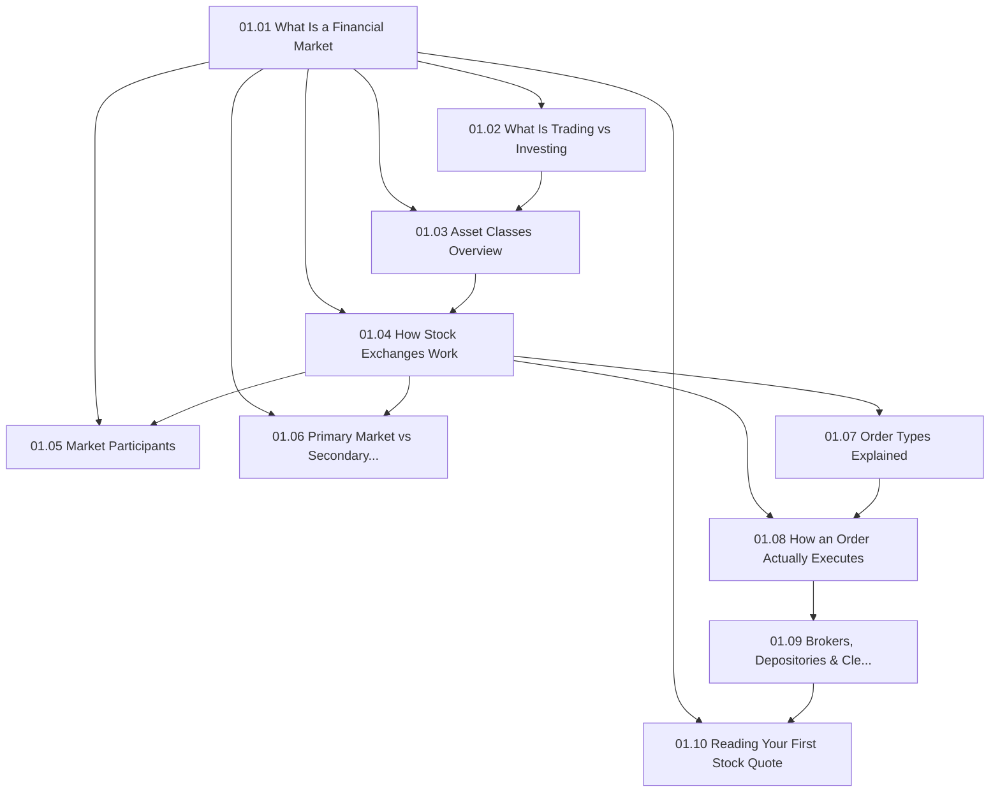
```mermaid
flowchart TD
    L01_01["01.01 What Is a Financial Market"] --> L01_02["01.02 What Is Trading vs Investing"]
    L01_03["01.03 Asset Classes Overview"]
    L01_04["01.04 How Stock Exchanges Work"]
    L01_05["01.05 Market Participants"]
    L01_06["01.06 Primary Market vs Secondary..."]
    L01_07["01.07 Order Types Explained"]
    L01_08["01.08 How an Order Actually Executes"] --> L01_09["01.09 Brokers, Depositories & Cle..."]
    L01_10["01.10 Reading Your First Stock Quote"]
    L01_01 --> L01_03
    L01_02 --> L01_03
    L01_01 --> L01_04
    L01_03 --> L01_04
    L01_01 --> L01_05
    L01_04 --> L01_05
    L01_01 --> L01_06
    L01_04 --> L01_06
    L01_04 --> L01_07
    L01_04 --> L01_08
    L01_07 --> L01_08
    L01_01 --> L01_10
    L01_09 --> L01_10
```

| Lesson | Prerequisites | Related Topics | Next Topic | Advanced Topics | Key Misconception |
|---|---|---|---|---|---|
| [`[01.01]`](docs/01_Foundation/01.01_What_Is_a_Financial_Market.md) What Is a Financial Market | — | `[01.06]`, `[01.07]` | `[01.02]` | `[01.03]`, `[01.04]`, `[01.05]` | You need to be rich to participate in a financial market. |
| [`[01.02]`](docs/01_Foundation/01.02_What_Is_Trading_vs_Investing.md) What Is Trading vs Investing | `[01.01]` | `[01.04]`, `[01.05]` | `[01.03]` | `[08.01]` | Trading is just short-term investing. |
| [`[01.03]`](docs/01_Foundation/01.03_Asset_Classes_Overview.md) Asset Classes Overview | `[01.01]`, `[01.02]` | `[01.05]`, `[01.06]` | `[01.04]` | `[03.08]`, `[03.10]`, `[04.04]` | Commodities are only for professional traders. |
| [`[01.04]`](docs/01_Foundation/01.04_How_Stock_Exchanges_Work.md) How Stock Exchanges Work | `[01.01]`, `[01.03]` | `[31.03]` | `[01.05]` | `[01.06]`, `[01.07]`, `[01.08]` | The exchange makes money when stock prices go up. |
| [`[01.05]`](docs/01_Foundation/01.05_Market_Participants.md) Market Participants | `[01.01]`, `[01.04]` | `[31.07]` | `[01.06]` | `[03.07]`, `[31.07]` | FIIs and DIIs always move in opposite directions. |
| [`[01.06]`](docs/01_Foundation/01.06_Primary_Market_vs_Secondary_Market.md) Primary Market vs Secondary Market | `[01.01]`, `[01.04]` | `[01.05]`, `[01.08]` | `[01.07]` | — | IPOs always make money for retail investors. |
| [`[01.07]`](docs/01_Foundation/01.07_Order_Types_Explained.md) Order Types Explained | `[01.04]` | `[25.03]` | `[01.08]` | `[24.07]` | A stop-loss order guarantees I'll lose exactly the amount I planned. |
| [`[01.08]`](docs/01_Foundation/01.08_How_an_Order_Actually_Executes.md) How an Order Actually Executes | `[01.04]`, `[01.07]` | `[03.06]` | `[01.09]` | `[03.06]`, `[29.05]` | My order goes directly to the stock exchange the instant I click Buy. |
| [`[01.09]`](docs/01_Foundation/01.09_Brokers_Depositories_Clearing_Corporations.md) Brokers, Depositories & Clearing Corporations | `[01.08]` | `[31.03]`, `[01.01]` | `[01.10]` | `[03.01]`, `[03.06]`, `[31.03]` | If my broker goes bankrupt, I lose my shares. |
| [`[01.10]`](docs/01_Foundation/01.10_Reading_Your_First_Stock_Quote.md) Reading Your First Stock Quote | `[01.01]`, `[01.09]` | `[01.04]`, `[21.11]`, `[01.05]`, `[01.07]` | `[02.01]` | `[10.03]`, `[10.08]`, `[11.01]` | A stock's LTP is the price I'll definitely get if I buy right now. |

### Module 02 — Market Structure

[Module Index](docs/02_Market_Structure/_Index.md)

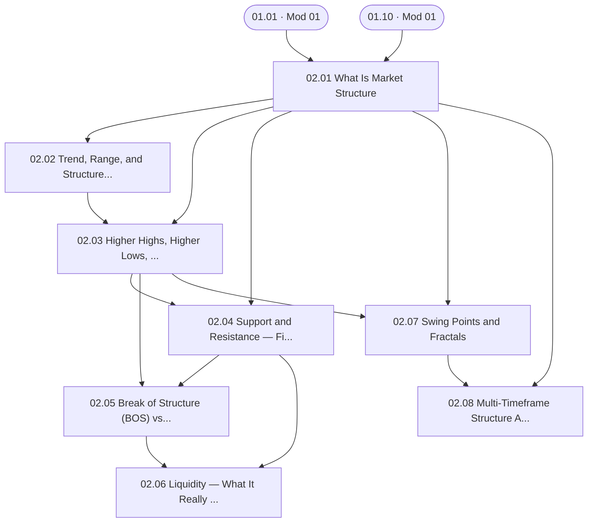
```mermaid
flowchart TD
    L01_01(["01.01 · Mod 01"])
    L01_10(["01.10 · Mod 01"])
    L02_01["02.01 What Is Market Structure"] --> L02_02["02.02 Trend, Range, and Structure..."]
    L02_03["02.03 Higher Highs, Higher Lows, ..."]
    L02_04["02.04 Support and Resistance — Fi..."]
    L02_05["02.05 Break of Structure (BOS) vs..."]
    L02_06["02.06 Liquidity — What It Really ..."]
    L02_07["02.07 Swing Points and Fractals"]
    L02_08["02.08 Multi-Timeframe Structure A..."]
    L01_01 --> L02_01
    L01_10 --> L02_01
    L02_01 --> L02_03
    L02_02 --> L02_03
    L02_01 --> L02_04
    L02_03 --> L02_04
    L02_03 --> L02_05
    L02_04 --> L02_05
    L02_04 --> L02_06
    L02_05 --> L02_06
    L02_01 --> L02_07
    L02_03 --> L02_07
    L02_01 --> L02_08
    L02_07 --> L02_08
```

| Lesson | Prerequisites | Related Topics | Next Topic | Advanced Topics | Key Misconception |
|---|---|---|---|---|---|
| [`[02.01]`](docs/02_Market_Structure/02.01_What_Is_Market_Structure.md) What Is Market Structure | `[01.01]`, `[01.10]` | `[02.05]`, `[02.08]`, `[04.03]`, `[04.06]` | `[02.02]` | `[02.03]`, `[02.04]`, `[02.07]` | Market structure is a specific trading strategy/school of thought. |
| [`[02.02]`](docs/02_Market_Structure/02.02_Trend_Range_and_Structure_Basics.md) Trend, Range, and Structure Basics | `[02.01]` | `[02.05]`, `[10.09]`, `[10.02]` | `[02.03]` | `[10.02]`, `[10.06]`, `[10.07]` | A pullback within a trend means the trend has ended. |
| [`[02.03]`](docs/02_Market_Structure/02.03_Higher_Highs_Higher_Lows_Lower_Highs_Lower_Lows.md) Higher Highs, Higher Lows, Lower Highs, Lower Lows | `[02.01]`, `[02.02]` | `[02.05]`, `[02.07]`, `[02.08]` | `[02.04]` | `[02.05]`, `[02.07]`, `[10.10]` | Any lower high means the trend is definitely over. |
| [`[02.04]`](docs/02_Market_Structure/02.04_Support_and_Resistance_First_Principles.md) Support and Resistance — First Principles | `[02.01]`, `[02.03]` | `[02.06]`, `[10.05]` | `[02.05]` | `[02.06]`, `[10.05]`, `[10.09]` | Support and resistance always hold exactly. |
| [`[02.05]`](docs/02_Market_Structure/02.05_Break_of_Structure_vs_Change_of_Character.md) Break of Structure (BOS) vs Change of Character (CHOCH) | `[02.03]`, `[02.04]` | `[02.02]`, `[02.08]` | `[02.06]` | `[12.01]`, `[13.05]` | CHOCH always means a full trend reversal is guaranteed. |
| [`[02.06]`](docs/02_Market_Structure/02.06_Liquidity_What_It_Really_Means.md) Liquidity — What It Really Means | `[02.04]`, `[02.05]` | `[20.06]`, `[01.10]`, `[21.11]`, `[01.07]` | `[02.07]` | `[12.10]`, `[13.04]`, `[17.06]` | Liquidity grabs are proof that 'big players' are personally targeting retai... |
| [`[02.07]`](docs/02_Market_Structure/02.07_Swing_Points_and_Fractals.md) Swing Points and Fractals | `[02.01]`, `[02.03]` | `[02.06]`, `[02.05]` | `[02.08]` | `[10.05]` | Fractals mean price patterns repeat identically at every scale, like a math... |
| [`[02.08]`](docs/02_Market_Structure/02.08_Multi_Timeframe_Structure_Analysis.md) Multi-Timeframe Structure Analysis | `[02.01]`, `[02.07]` | `[01.03]` | `[03.01]` | `[10.04]`, `[15.06]`, `[24.06]` | Higher timeframe structure is always 'more true' and lower timeframe struct... |

### Module 03 — Indian Market

[Module Index](docs/03_Indian_Market/_Index.md)

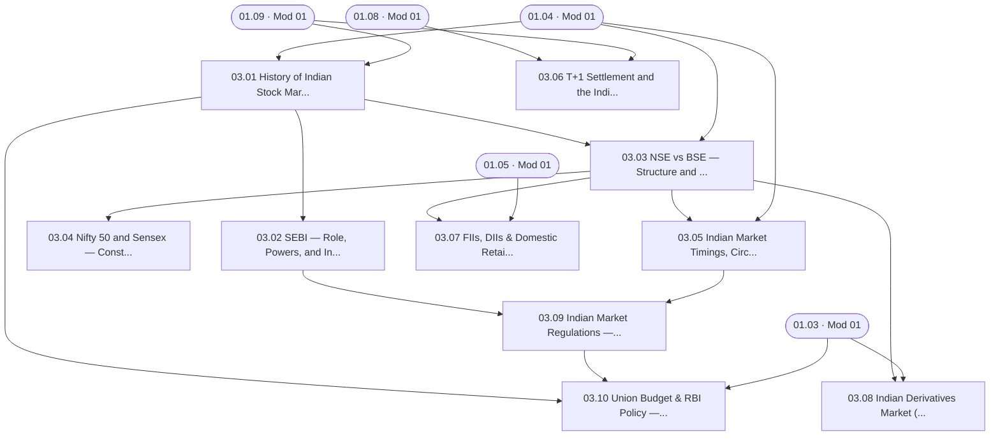
```mermaid
flowchart TD
    L01_04(["01.04 · Mod 01"])
    L01_09(["01.09 · Mod 01"])
    L01_08(["01.08 · Mod 01"])
    L01_05(["01.05 · Mod 01"])
    L01_03(["01.03 · Mod 01"])
    L03_01["03.01 History of Indian Stock Mar..."] --> L03_02["03.02 SEBI — Role, Powers, and In..."]
    L03_03["03.03 NSE vs BSE — Structure and ..."] --> L03_04["03.04 Nifty 50 and Sensex — Const..."]
    L03_05["03.05 Indian Market Timings, Circ..."]
    L03_06["03.06 T+1 Settlement and the Indi..."]
    L03_07["03.07 FIIs, DIIs & Domestic Retai..."]
    L03_08["03.08 Indian Derivatives Market (..."]
    L03_09["03.09 Indian Market Regulations —..."]
    L03_10["03.10 Union Budget & RBI Policy —..."]
    L01_04 --> L03_01
    L01_09 --> L03_01
    L03_01 --> L03_03
    L01_04 --> L03_03
    L03_03 --> L03_05
    L01_04 --> L03_05
    L01_08 --> L03_06
    L01_09 --> L03_06
    L03_03 --> L03_07
    L01_05 --> L03_07
    L03_03 --> L03_08
    L01_03 --> L03_08
    L03_02 --> L03_09
    L03_05 --> L03_09
    L03_01 --> L03_10
    L03_09 --> L03_10
    L01_03 --> L03_10
```

| Lesson | Prerequisites | Related Topics | Next Topic | Advanced Topics | Key Misconception |
|---|---|---|---|---|---|
| [`[03.01]`](docs/03_Indian_Market/03.01_History_of_Indian_Stock_Markets.md) History of Indian Stock Markets (BSE 1875 to NSE 1992) | `[01.04]`, `[01.09]` | `[01.01]`, `[31.03]` | `[03.02]` | `[03.03]`, `[03.10]`, `[11.09]` | BSE and NSE have always operated identically. |
| [`[03.02]`](docs/03_Indian_Market/03.02_SEBI_Role_Powers_and_Investor_Protection.md) SEBI — Role, Powers, and Investor Protection | `[03.01]` | `[01.01]`, `[21.12]` | `[03.03]` | `[03.09]`, `[29.07]` | SEBI can guarantee I won't lose money if I follow all the rules. |
| [`[03.03]`](docs/03_Indian_Market/03.03_NSE_vs_BSE_Structure_and_Indices.md) NSE vs BSE — Structure and Indices | `[01.04]`, `[03.01]` | `[01.08]` | `[03.04]` | `[03.05]`, `[03.07]`, `[03.08]` | Sensex and Nifty always move by the exact same percentage. |
| [`[03.04]`](docs/03_Indian_Market/03.04_Nifty_50_and_Sensex_Construction_Methodology.md) Nifty 50 and Sensex — Construction Methodology | `[03.03]` | `[03.02]`, `[03.06]` | `[03.05]` | `[04.05]`, `[23.02]` | A stock's total market cap determines its index weight. |
| [`[03.05]`](docs/03_Indian_Market/03.05_Indian_Market_Timings_Circuits_and_Trading_Sessions.md) Indian Market Timings, Circuits & Trading Sessions | `[01.04]`, `[03.03]` | `[01.08]`, `[03.10]`, `[01.07]`, `[02.06]` | `[03.06]` | `[03.09]`, `[04.02]`, `[19.07]` | Circuit filters and circuit breakers are the same mechanism. |
| [`[03.06]`](docs/03_Indian_Market/03.06_T+1_Settlement_and_the_Indian_Clearing_System.md) T+1 Settlement and the Indian Clearing System | `[01.08]`, `[01.09]` | `[01.05]`, `[31.07]`, `[03.01]` | `[03.07]` | — | T+1 means you own the shares the instant you buy them. |
| [`[03.07]`](docs/03_Indian_Market/03.07_FIIs_DIIs_and_Domestic_Retail_Who_Moves_Nifty.md) FIIs, DIIs & Domestic Retail — Who Moves Nifty | `[01.05]`, `[03.03]` | `[01.03]`, `[02.08]`, `[03.04]` | `[03.08]` | `[04.07]`, `[17.08]` | FIIs and retail/DIIs are always on opposite sides of every trade. |
| [`[03.08]`](docs/03_Indian_Market/03.08_Indian_Derivatives_Market_FO_Overview.md) Indian Derivatives Market (F&O) Overview | `[01.03]`, `[03.03]` | `[03.01]`, `[03.02]`, `[21.12]` | `[03.09]` | `[20.01]`, `[20.03]`, `[20.07]` | India's F&O market is uniquely dangerous compared to other countries' deriv... |
| [`[03.09]`](docs/03_Indian_Market/03.09_Indian_Market_Regulations_Insider_Trading_Circuit_Filters_Surveillance.md) Indian Market Regulations — Insider Trading, Circuit Filters, Surveillance | `[03.02]`, `[03.05]` | `[01.01]`, `[03.01]` | `[03.10]` | `[31.04]` | Insider trading only applies to company executives. |
| [`[03.10]`](docs/03_Indian_Market/03.10_Union_Budget_and_RBI_Policy_Effect_on_Indian_Markets.md) Union Budget & RBI Policy — Their Effect on Indian Markets | `[03.01]`, `[03.09]`, `[01.03]` | `[03.05]`, `[03.08]` | `[04.01]` | `[04.08]`, `[05.07]`, `[24.10]` | A rate cut is always good for the stock market, and a rate hike is always bad. |

### Module 04 — Global Market

[Module Index](docs/04_Global_Market/_Index.md)

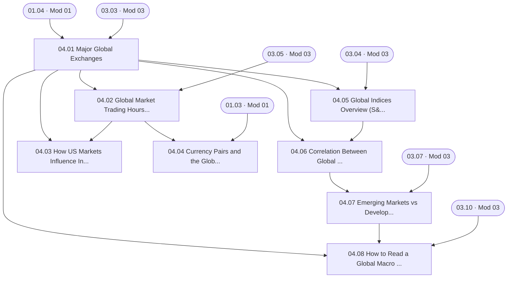
```mermaid
flowchart TD
    L01_04(["01.04 · Mod 01"])
    L03_03(["03.03 · Mod 03"])
    L03_05(["03.05 · Mod 03"])
    L01_03(["01.03 · Mod 01"])
    L03_04(["03.04 · Mod 03"])
    L03_07(["03.07 · Mod 03"])
    L03_10(["03.10 · Mod 03"])
    L04_01["04.01 Major Global Exchanges"]
    L04_02["04.02 Global Market Trading Hours..."]
    L04_03["04.03 How US Markets Influence In..."]
    L04_04["04.04 Currency Pairs and the Glob..."]
    L04_05["04.05 Global Indices Overview (S&..."]
    L04_06["04.06 Correlation Between Global ..."]
    L04_07["04.07 Emerging Markets vs Develop..."]
    L04_08["04.08 How to Read a Global Macro ..."]
    L01_04 --> L04_01
    L03_03 --> L04_01
    L04_01 --> L04_02
    L03_05 --> L04_02
    L04_01 --> L04_03
    L04_02 --> L04_03
    L04_02 --> L04_04
    L01_03 --> L04_04
    L04_01 --> L04_05
    L03_04 --> L04_05
    L04_01 --> L04_06
    L04_05 --> L04_06
    L04_06 --> L04_07
    L03_07 --> L04_07
    L04_01 --> L04_08
    L04_07 --> L04_08
    L03_10 --> L04_08
```

| Lesson | Prerequisites | Related Topics | Next Topic | Advanced Topics | Key Misconception |
|---|---|---|---|---|---|
| [`[04.01]`](docs/04_Global_Market/04.01_Major_Global_Exchanges.md) Major Global Exchanges | `[01.04]`, `[03.03]` | `[04.03]`, `[04.06]`, `[04.07]` | `[04.02]` | `[04.03]`, `[04.05]`, `[04.06]` | All major exchanges move in lockstep. |
| [`[04.02]`](docs/04_Global_Market/04.02_Global_Market_Trading_Hours_and_Overlaps.md) Global Market Trading Hours and Overlaps | `[04.01]`, `[03.05]` | `[04.04]`, `[01.07]`, `[02.06]` | `[04.03]` | `[04.04]`, `[19.01]`, `[19.03]` | All trading hours are equally liquid. |
| [`[04.03]`](docs/04_Global_Market/04.03_How_US_Markets_Influence_Indian_Markets.md) How US Markets Influence Indian Markets (SGX Nifty / GIFT Nifty) | `[04.01]`, `[04.02]` | `[03.05]` | `[04.04]` | — | GIFT Nifty and Nifty 50 always open at exactly the same level. |
| [`[04.04]`](docs/04_Global_Market/04.04_Currency_Pairs_and_the_Global_FX_Market.md) Currency Pairs and the Global FX Market | `[01.03]`, `[04.02]` | `[01.04]`, `[02.08]`, `[03.07]` | `[04.05]` | `[06.04]`, `[06.05]` | A weakening currency is always bad for a country. |
| [`[04.05]`](docs/04_Global_Market/04.05_Global_Indices_Overview.md) Global Indices Overview (S&P 500, Dow, Nasdaq, DAX, Nikkei) | `[03.04]`, `[04.01]` | `[04.03]` | `[04.06]` | — | A higher-priced stock is automatically a 'better' or 'bigger' company. |
| [`[04.06]`](docs/04_Global_Market/04.06_Correlation_Between_Global_Markets.md) Correlation Between Global Markets | `[04.01]`, `[04.05]` | `[03.07]`, `[31.01]`, `[01.03]` | `[04.07]` | `[06.06]`, `[06.09]`, `[23.03]` | Global markets are either always correlated or never correlated. |
| [`[04.07]`](docs/04_Global_Market/04.07_Emerging_Markets_vs_Developed_Markets.md) Emerging Markets vs Developed Markets | `[03.07]`, `[04.06]` | `[03.04]`, `[04.01]`, `[04.05]`, `[03.10]` | `[04.08]` | — | Emerging markets are always riskier and offer no advantages over developed... |
| [`[04.08]`](docs/04_Global_Market/04.08_How_to_Read_a_Global_Macro_Calendar.md) How to Read a Global Macro Calendar | `[04.01]`, `[04.07]`, `[03.10]` | `[04.06]`, `[04.05]` | `[05.01]` | — | A macro calendar lets you predict exactly how the market will react. |

### Module 05 — Economics

[Module Index](docs/05_Economics/_Index.md)

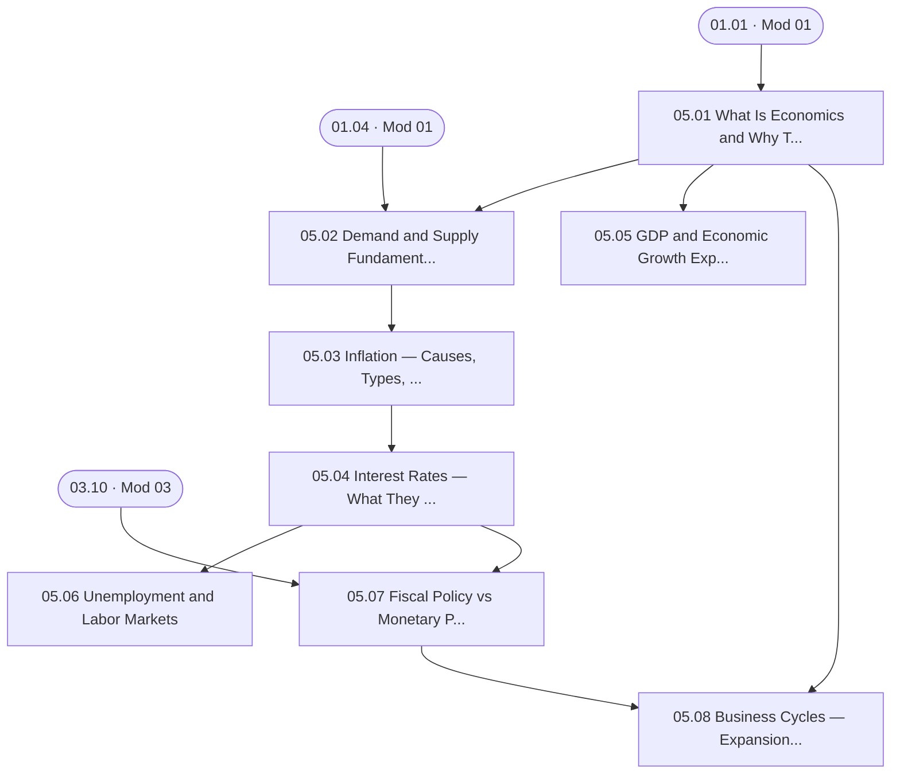
```mermaid
flowchart TD
    L01_01(["01.01 · Mod 01"])
    L01_04(["01.04 · Mod 01"])
    L03_10(["03.10 · Mod 03"])
    L05_01["05.01 What Is Economics and Why T..."]
    L05_02["05.02 Demand and Supply Fundament..."] --> L05_03["05.03 Inflation — Causes, Types, ..."] --> L05_04["05.04 Interest Rates — What They ..."]
    L05_05["05.05 GDP and Economic Growth Exp..."]
    L05_06["05.06 Unemployment and Labor Markets"]
    L05_07["05.07 Fiscal Policy vs Monetary P..."]
    L05_08["05.08 Business Cycles — Expansion..."]
    L01_01 --> L05_01
    L05_01 --> L05_02
    L01_04 --> L05_02
    L05_01 --> L05_05
    L05_04 --> L05_06
    L05_04 --> L05_07
    L03_10 --> L05_07
    L05_01 --> L05_08
    L05_07 --> L05_08
```

| Lesson | Prerequisites | Related Topics | Next Topic | Advanced Topics | Key Misconception |
|---|---|---|---|---|---|
| [`[05.01]`](docs/05_Economics/05.01_What_Is_Economics_and_Why_Traders_Need_It.md) What Is Economics and Why Traders Need It | `[01.01]` | `[03.01]`, `[06.01]`, `[04.04]`, `[31.01]` | `[05.02]` | `[05.05]`, `[05.08]`, `[07.01]` | Economics is just theory with no practical trading relevance. |
| [`[05.02]`](docs/05_Economics/05.02_Demand_and_Supply_Fundamentals_for_Markets.md) Demand and Supply Fundamentals for Markets | `[05.01]`, `[01.04]` | `[05.04]`, `[05.05]` | `[05.03]` | `[06.08]` | Demand and supply only apply to goods you can physically touch, like vegeta... |
| [`[05.03]`](docs/05_Economics/05.03_Inflation_Causes_Types_and_Measurement.md) Inflation — Causes, Types, and Measurement | `[05.02]` | `[06.10]`, `[03.10]`, `[04.08]`, `[04.06]` | `[05.04]` | — | Inflation is always bad and should always be minimized to zero. |
| [`[05.04]`](docs/05_Economics/05.04_Interest_Rates_What_They_Are_and_Why_They_Move_Markets.md) Interest Rates — What They Are and Why They Move Markets | `[05.03]` | `[04.04]`, `[03.10]`, `[04.08]`, `[09.03]` | `[05.05]` | `[05.06]`, `[05.07]`, `[06.01]` | Higher interest rates are always bad for stocks. |
| [`[05.05]`](docs/05_Economics/05.05_GDP_and_Economic_Growth_Explained.md) GDP and Economic Growth Explained | `[05.01]` | `[05.08]`, `[04.08]`, `[03.07]`, `[04.07]` | `[05.06]` | — | Higher GDP growth is always unambiguously good for markets. |
| [`[05.06]`](docs/05_Economics/05.06_Unemployment_and_Labor_Markets.md) Unemployment and Labor Markets | `[05.04]` | `[05.05]`, `[06.01]`, `[04.08]`, `[04.06]` | `[05.07]` | — | A falling unemployment rate is always unambiguously good news. |
| [`[05.07]`](docs/05_Economics/05.07_Fiscal_Policy_vs_Monetary_Policy.md) Fiscal Policy vs Monetary Policy | `[03.10]`, `[05.04]` | `[05.03]`, `[03.01]`, `[04.08]` | `[05.08]` | `[06.01]`, `[06.10]` | Fiscal and monetary policy are controlled by the same institution. |
| [`[05.08]`](docs/05_Economics/05.08_Business_Cycles_Expansion_Peak_Recession_Trough.md) Business Cycles — Expansion, Peak, Recession, Trough | `[05.01]`, `[05.07]` | `[03.01]`, `[05.03]`, `[05.04]`, `[31.01]` | `[06.01]` | `[06.07]`, `[09.08]`, `[27.06]` | Business cycles are perfectly regular and predictable in length. |

### Module 06 — Macroeconomics

[Module Index](docs/06_Macroeconomics/_Index.md)

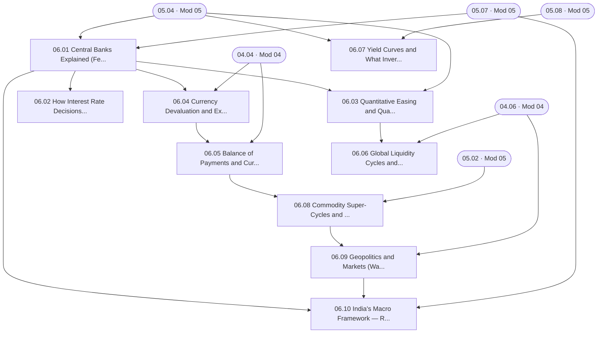
```mermaid
flowchart TD
    L05_04(["05.04 · Mod 05"])
    L05_07(["05.07 · Mod 05"])
    L04_04(["04.04 · Mod 04"])
    L04_06(["04.06 · Mod 04"])
    L05_08(["05.08 · Mod 05"])
    L05_02(["05.02 · Mod 05"])
    L06_01["06.01 Central Banks Explained (Fe..."] --> L06_02["06.02 How Interest Rate Decisions..."]
    L06_03["06.03 Quantitative Easing and Qua..."]
    L06_04["06.04 Currency Devaluation and Ex..."]
    L06_05["06.05 Balance of Payments and Cur..."]
    L06_06["06.06 Global Liquidity Cycles and..."]
    L06_07["06.07 Yield Curves and What Inver..."]
    L06_08["06.08 Commodity Super-Cycles and ..."]
    L06_09["06.09 Geopolitics and Markets (Wa..."]
    L06_10["06.10 India's Macro Framework — R..."]
    L05_04 --> L06_01
    L05_07 --> L06_01
    L06_01 --> L06_03
    L05_04 --> L06_03
    L06_01 --> L06_04
    L04_04 --> L06_04
    L06_04 --> L06_05
    L04_04 --> L06_05
    L06_03 --> L06_06
    L04_06 --> L06_06
    L05_04 --> L06_07
    L05_08 --> L06_07
    L06_05 --> L06_08
    L05_02 --> L06_08
    L06_08 --> L06_09
    L04_06 --> L06_09
    L06_01 --> L06_10
    L06_09 --> L06_10
    L05_07 --> L06_10
```

| Lesson | Prerequisites | Related Topics | Next Topic | Advanced Topics | Key Misconception |
|---|---|---|---|---|---|
| [`[06.01]`](docs/06_Macroeconomics/06.01_Central_Banks_Explained.md) Central Banks Explained (Federal Reserve, RBI, ECB) | `[05.04]`, `[05.07]` | `[06.10]`, `[03.01]`, `[03.10]`, `[04.08]` | `[06.02]` | `[06.03]`, `[06.04]`, `[06.10]` | Central banks can single-handedly control the entire economy. |
| [`[06.02]`](docs/06_Macroeconomics/06.02_How_Interest_Rate_Decisions_Are_Made.md) How Interest Rate Decisions Are Made | `[06.01]` | `[05.03]`, `[05.05]`, `[05.06]`, `[03.10]` | `[06.03]` | — | A rate decision is purely mechanical, following a fixed formula from econom... |
| [`[06.03]`](docs/06_Macroeconomics/06.03_Quantitative_Easing_and_Quantitative_Tightening.md) Quantitative Easing and Quantitative Tightening | `[06.01]`, `[05.04]` | `[06.02]`, `[03.07]`, `[04.04]`, `[31.01]` | `[06.04]` | `[06.06]` | QE is the same as the government printing physical currency and handing it... |
| [`[06.04]`](docs/06_Macroeconomics/06.04_Currency_Devaluation_and_Exchange_Rate_Regimes.md) Currency Devaluation and Exchange Rate Regimes | `[04.04]`, `[06.01]` | `[05.02]`, `[03.07]`, `[01.04]` | `[06.05]` | — | India's rupee has a fixed target value the RBI defends at all costs. |
| [`[06.05]`](docs/06_Macroeconomics/06.05_Balance_of_Payments_and_Current_Account_Deficit.md) Balance of Payments and Current Account Deficit | `[06.04]`, `[04.04]` | `[03.07]`, `[04.06]`, `[01.03]`, `[02.08]` | `[06.06]` | `[06.08]` | A current account deficit always means a country is in economic trouble. |
| [`[06.06]`](docs/06_Macroeconomics/06.06_Global_Liquidity_Cycles_and_Risk_On_Risk_Off.md) Global Liquidity Cycles and Risk-On/Risk-Off | `[06.03]`, `[04.06]` | `[04.04]`, `[05.04]`, `[23.02]`, `[23.03]` | `[06.07]` | — | Risk-on and risk-off are the same as bull and bear markets. |
| [`[06.07]`](docs/06_Macroeconomics/06.07_Yield_Curves_and_What_Inversion_Means.md) Yield Curves and What Inversion Means | `[05.04]`, `[05.08]` | `[06.02]`, `[06.06]`, `[06.04]`, `[31.01]` | `[06.08]` | — | Yield curve inversion means a recession will start immediately. |
| [`[06.08]`](docs/06_Macroeconomics/06.08_Commodity_Super_Cycles_and_Macro_Trading.md) Commodity Super-Cycles and Macro Trading | `[05.02]`, `[06.05]` | `[06.04]`, `[05.03]`, `[27.06]` | `[06.09]` | `[20.10]` | Commodity super-cycles are short-term, weeks-to-months phenomena. |
| [`[06.09]`](docs/06_Macroeconomics/06.09_Geopolitics_and_Markets.md) Geopolitics and Markets (Wars, Sanctions, Trade Deals) | `[06.08]`, `[04.06]` | `[06.04]`, `[06.06]`, `[03.10]`, `[04.08]` | `[06.10]` | — | All geopolitical shocks produce permanent, lasting market effects. |
| [`[06.10]`](docs/06_Macroeconomics/06.10_Indias_Macro_Framework_RBI_Inflation_Targeting.md) India's Macro Framework — RBI's Inflation Targeting Regime | `[06.01]`, `[06.09]`, `[05.07]` | `[05.03]`, `[06.02]`, `[05.04]`, `[06.04]` | `[07.01]` | — | RBI's only job is hitting exactly 4% inflation at all times, ignoring every... |

### Module 07 — Financial Statements

[Module Index](docs/07_Financial_Statements/_Index.md)

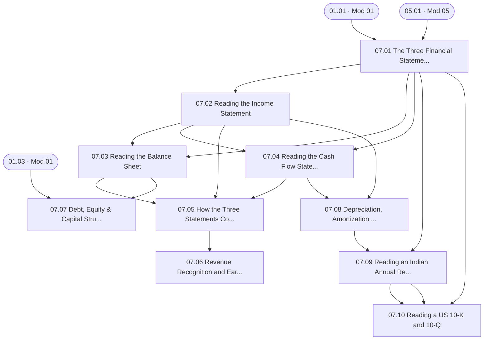
```mermaid
flowchart TD
    L01_01(["01.01 · Mod 01"])
    L05_01(["05.01 · Mod 05"])
    L01_03(["01.03 · Mod 01"])
    L07_01["07.01 The Three Financial Stateme..."] --> L07_02["07.02 Reading the Income Statement"]
    L07_03["07.03 Reading the Balance Sheet"]
    L07_04["07.04 Reading the Cash Flow State..."]
    L07_05["07.05 How the Three Statements Co..."] --> L07_06["07.06 Revenue Recognition and Ear..."]
    L07_07["07.07 Debt, Equity & Capital Stru..."]
    L07_08["07.08 Depreciation, Amortization ..."]
    L07_09["07.09 Reading an Indian Annual Re..."]
    L07_10["07.10 Reading a US 10-K and 10-Q"]
    L01_01 --> L07_01
    L05_01 --> L07_01
    L07_01 --> L07_03
    L07_02 --> L07_03
    L07_01 --> L07_04
    L07_02 --> L07_04
    L07_02 --> L07_05
    L07_03 --> L07_05
    L07_04 --> L07_05
    L07_03 --> L07_07
    L01_03 --> L07_07
    L07_02 --> L07_08
    L07_04 --> L07_08
    L07_01 --> L07_09
    L07_08 --> L07_09
    L07_01 --> L07_10
    L07_09 --> L07_10
    L07_09 --> L07_10
```

| Lesson | Prerequisites | Related Topics | Next Topic | Advanced Topics | Key Misconception |
|---|---|---|---|---|---|
| [`[07.01]`](docs/07_Financial_Statements/07.01_The_Three_Financial_Statements_Overview.md) The Three Financial Statements — Overview | `[01.01]`, `[05.01]` | `[07.05]`, `[07.09]`, `[03.02]`, `[07.10]` | `[07.02]` | `[07.03]`, `[07.04]`, `[07.09]` | A company reporting a profit is automatically in good financial health. |
| [`[07.02]`](docs/07_Financial_Statements/07.02_Reading_the_Income_Statement.md) Reading the Income Statement | `[07.01]` | `[08.07]`, `[07.06]` | `[07.03]` | `[07.04]`, `[07.05]`, `[07.08]` | Net profit is the only number that matters on the income statement. |
| [`[07.03]`](docs/07_Financial_Statements/07.03_Reading_the_Balance_Sheet.md) Reading the Balance Sheet | `[07.01]`, `[07.02]` | `[31.01]` | `[07.04]` | `[07.05]`, `[07.07]`, `[08.03]` | A company with large total assets is automatically financially strong. |
| [`[07.04]`](docs/07_Financial_Statements/07.04_Reading_the_Cash_Flow_Statement.md) Reading the Cash Flow Statement | `[07.01]`, `[07.02]` | `[09.03]` | `[07.05]` | `[07.08]`, `[09.03]` | Positive net profit always means positive cash flow. |
| [`[07.05]`](docs/07_Financial_Statements/07.05_How_the_Three_Statements_Connect.md) How the Three Statements Connect | `[07.02]`, `[07.03]`, `[07.04]` | `[01.06]`, `[07.01]`, `[31.10]` | `[07.06]` | — | The three statements are independent documents with no required relationshi... |
| [`[07.06]`](docs/07_Financial_Statements/07.06_Revenue_Recognition_and_Earnings_Quality.md) Revenue Recognition and Earnings Quality | `[07.05]` | `[07.04]`, `[07.03]`, `[03.02]`, `[03.09]` | `[07.07]` | `[31.10]` | Any company using judgment in revenue recognition is committing fraud. |
| [`[07.07]`](docs/07_Financial_Statements/07.07_Debt_Equity_and_Capital_Structure.md) Debt, Equity & Capital Structure on the Balance Sheet | `[07.03]`, `[01.03]` | `[31.01]` | `[07.08]` | `[08.04]`, `[31.01]` | Zero debt is always the safest, best capital structure. |
| [`[07.08]`](docs/07_Financial_Statements/07.08_Depreciation_Amortization_and_Non_Cash_Items.md) Depreciation, Amortization & Non-Cash Items | `[07.02]`, `[07.04]` | `[07.07]`, `[07.06]` | `[07.09]` | `[09.02]` | Depreciation means the asset has no remaining value. |
| [`[07.09]`](docs/07_Financial_Statements/07.09_Reading_an_Indian_Annual_Report.md) Reading an Indian Annual Report (BSE/NSE Filings) | `[07.01]`, `[07.08]` | `[03.02]`, `[07.04]`, `[07.06]`, `[07.05]` | `[07.10]` | `[08.08]` | Reading an annual report requires an accounting or finance degree. |
| [`[07.10]`](docs/07_Financial_Statements/07.10_Reading_a_US_10K_and_10Q.md) Reading a US 10-K and 10-Q | `[07.01]`, `[07.09]`, `[07.09]` | `[07.04]`, `[07.06]`, `[07.05]`, `[04.07]` | `[08.01]` | — | 10-Ks are only useful for professional analysts, not retail investors. |

### Module 08 — Fundamental Analysis

[Module Index](docs/08_Fundamental_Analysis/_Index.md)

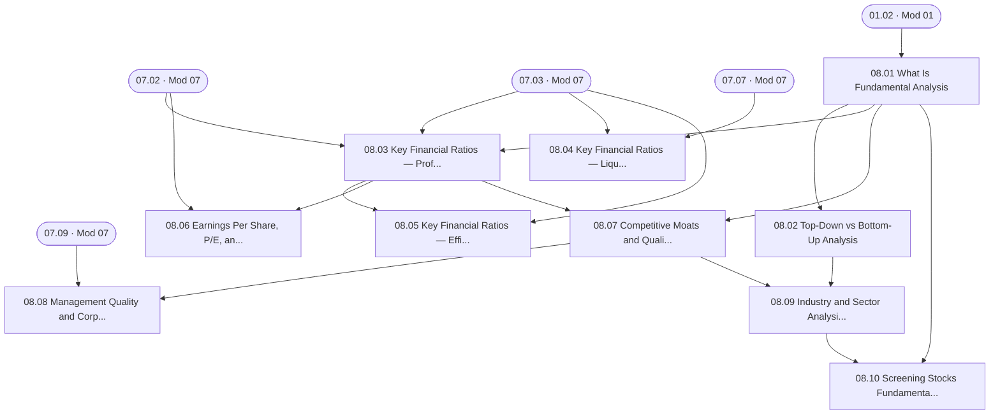
```mermaid
flowchart TD
    L01_02(["01.02 · Mod 01"])
    L07_02(["07.02 · Mod 07"])
    L07_03(["07.03 · Mod 07"])
    L07_07(["07.07 · Mod 07"])
    L07_09(["07.09 · Mod 07"])
    L08_01["08.01 What Is Fundamental Analysis"] --> L08_02["08.02 Top-Down vs Bottom-Up Analysis"]
    L08_03["08.03 Key Financial Ratios — Prof..."]
    L08_04["08.04 Key Financial Ratios — Liqu..."]
    L08_05["08.05 Key Financial Ratios — Effi..."]
    L08_06["08.06 Earnings Per Share, P/E, an..."]
    L08_07["08.07 Competitive Moats and Quali..."]
    L08_08["08.08 Management Quality and Corp..."]
    L08_09["08.09 Industry and Sector Analysi..."]
    L08_10["08.10 Screening Stocks Fundamenta..."]
    L01_02 --> L08_01
    L08_01 --> L08_03
    L07_02 --> L08_03
    L07_03 --> L08_03
    L07_03 --> L08_04
    L07_07 --> L08_04
    L08_03 --> L08_05
    L07_03 --> L08_05
    L08_03 --> L08_06
    L07_02 --> L08_06
    L08_01 --> L08_07
    L08_03 --> L08_07
    L08_07 --> L08_08
    L07_09 --> L08_08
    L08_02 --> L08_09
    L08_07 --> L08_09
    L08_01 --> L08_10
    L08_09 --> L08_10
```

| Lesson | Prerequisites | Related Topics | Next Topic | Advanced Topics | Key Misconception |
|---|---|---|---|---|---|
| [`[08.01]`](docs/08_Fundamental_Analysis/08.01_What_Is_Fundamental_Analysis.md) What Is Fundamental Analysis | `[01.02]` | `[01.01]`, `[08.07]`, `[08.09]`, `[09.02]` | `[08.02]` | `[08.03]`, `[08.07]`, `[08.10]` | Fundamental analysis and technical analysis are mutually exclusive — you mu... |
| [`[08.02]`](docs/08_Fundamental_Analysis/08.02_Top_Down_vs_Bottom_Up_Analysis.md) Top-Down vs Bottom-Up Analysis | `[08.01]` | `[04.07]`, `[05.05]`, `[06.10]`, `[08.07]` | `[08.03]` | `[08.09]` | You must choose exclusively one approach and never use the other. |
| [`[08.03]`](docs/08_Fundamental_Analysis/08.03_Key_Financial_Ratios_Profitability.md) Key Financial Ratios — Profitability | `[07.02]`, `[07.03]`, `[08.01]` | `[07.07]`, `[08.05]`, `[31.01]` | `[08.04]` | `[08.05]`, `[08.06]`, `[08.07]` | Higher ROE always means a better-run, superior company. |
| [`[08.04]`](docs/08_Fundamental_Analysis/08.04_Key_Financial_Ratios_Liquidity_and_Solvency.md) Key Financial Ratios — Liquidity and Solvency | `[07.03]`, `[07.07]` | `[31.01]` | `[08.05]` | — | Liquidity and solvency are the same thing, just different names. |
| [`[08.05]`](docs/08_Fundamental_Analysis/08.05_Key_Financial_Ratios_Efficiency.md) Key Financial Ratios — Efficiency | `[08.03]`, `[07.03]` | `[07.06]`, `[08.04]` | `[08.06]` | — | Efficiency ratios are less important than profitability ratios. |
| [`[08.06]`](docs/08_Fundamental_Analysis/08.06_EPS_PE_and_Growth_Metrics.md) Earnings Per Share, P/E, and Growth Metrics | `[07.02]`, `[08.03]` | `[09.02]`, `[01.02]`, `[07.07]`, `[07.10]` | `[08.07]` | `[09.02]` | A low P/E always means a stock is undervalued. |
| [`[08.07]`](docs/08_Fundamental_Analysis/08.07_Competitive_Moats_and_Qualitative_Analysis.md) Competitive Moats and Qualitative Analysis | `[08.01]`, `[08.03]` | `[08.06]`, `[08.05]` | `[08.08]` | `[08.09]` | A strong current brand or market position always means a permanent, unassai... |
| [`[08.08]`](docs/08_Fundamental_Analysis/08.08_Management_Quality_and_Corporate_Governance.md) Management Quality and Corporate Governance | `[08.07]`, `[07.09]` | `[07.06]`, `[07.04]`, `[08.03]`, `[08.06]` | `[08.09]` | `[31.06]`, `[31.10]` | Management quality is purely subjective and can't be systematically assessed. |
| [`[08.09]`](docs/08_Fundamental_Analysis/08.09_Industry_and_Sector_Analysis_Framework.md) Industry and Sector Analysis Framework | `[08.02]`, `[08.07]` | `[27.06]` | `[08.10]` | `[09.06]` | A well-managed company will succeed regardless of its industry's structural... |
| [`[08.10]`](docs/08_Fundamental_Analysis/08.10_Screening_Stocks_Fundamentally.md) Screening Stocks Fundamentally (India & US) | `[08.01]`, `[08.09]` | `[08.07]`, `[08.03]`, `[08.04]`, `[08.05]` | `[09.01]` | `[24.08]` | A stock passing all quantitative screening criteria is guaranteed to be a g... |

### Module 09 — Valuation

[Module Index](docs/09_Valuation/_Index.md)

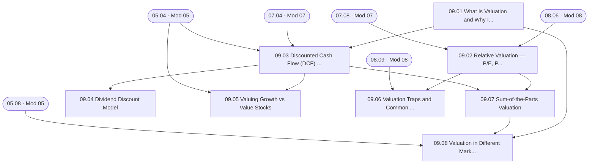
```mermaid
flowchart TD
    L08_06(["08.06 · Mod 08"])
    L07_08(["07.08 · Mod 07"])
    L07_04(["07.04 · Mod 07"])
    L05_04(["05.04 · Mod 05"])
    L08_09(["08.09 · Mod 08"])
    L05_08(["05.08 · Mod 05"])
    L09_01["09.01 What Is Valuation and Why I..."]
    L09_02["09.02 Relative Valuation — P/E, P..."]
    L09_03["09.03 Discounted Cash Flow (DCF) ..."] --> L09_04["09.04 Dividend Discount Model"]
    L09_05["09.05 Valuing Growth vs Value Stocks"]
    L09_06["09.06 Valuation Traps and Common ..."]
    L09_07["09.07 Sum-of-the-Parts Valuation"]
    L09_08["09.08 Valuation in Different Mark..."]
    L08_06 --> L09_02
    L07_08 --> L09_02
    L09_01 --> L09_03
    L07_04 --> L09_03
    L05_04 --> L09_03
    L09_03 --> L09_05
    L05_04 --> L09_05
    L09_02 --> L09_06
    L08_09 --> L09_06
    L09_02 --> L09_07
    L09_03 --> L09_07
    L09_01 --> L09_08
    L09_07 --> L09_08
    L05_08 --> L09_08
```

| Lesson | Prerequisites | Related Topics | Next Topic | Advanced Topics | Key Misconception |
|---|---|---|---|---|---|
| [`[09.01]`](docs/09_Valuation/09.01_What_Is_Valuation_and_Why_It_Matters.md) What Is Valuation and Why It Matters | — | `[01.01]`, `[08.06]`, `[08.01]`, `[09.06]` | `[09.02]` | `[09.03]`, `[09.08]`, `[31.09]` | A stock's price always reflects its true value in an efficient market. |
| [`[09.02]`](docs/09_Valuation/09.02_Relative_Valuation_PE_PB_EV_EBITDA.md) Relative Valuation — P/E, P/B, EV/EBITDA | `[08.06]`, `[07.08]` | `[07.03]`, `[07.07]`, `[08.09]`, `[08.07]` | `[09.03]` | `[09.06]`, `[09.07]` | P/E is always the best, most universal valuation multiple. |
| [`[09.03]`](docs/09_Valuation/09.03_Discounted_Cash_Flow_Fundamentals.md) Discounted Cash Flow (DCF) Fundamentals | `[07.04]`, `[05.04]`, `[09.01]` | `[07.07]`, `[09.02]`, `[06.02]`, `[05.05]` | `[09.04]` | `[09.05]`, `[09.07]` | DCF produces an objective, precise 'true' value. |
| [`[09.04]`](docs/09_Valuation/09.04_Dividend_Discount_Model.md) Dividend Discount Model | `[09.03]` | `[09.02]`, `[09.06]` | `[09.05]` | — | DDM and DCF are interchangeable and always produce similar results. |
| [`[09.05]`](docs/09_Valuation/09.05_Valuing_Growth_vs_Value_Stocks.md) Valuing Growth vs Value Stocks | `[09.03]`, `[05.04]` | `[08.06]`, `[09.02]`, `[09.04]`, `[06.02]` | `[09.06]` | — | Growth stocks are always better long-term investments than value stocks, or... |
| [`[09.06]`](docs/09_Valuation/09.06_Valuation_Traps_and_Common_Mistakes.md) Valuation Traps and Common Mistakes | `[09.02]`, `[08.09]` | `[08.07]`, `[08.08]`, `[08.10]` | `[09.07]` | — | Any stock trading below its historical average multiple is undervalued. |
| [`[09.07]`](docs/09_Valuation/09.07_Sum_of_the_Parts_Valuation.md) Sum-of-the-Parts Valuation | `[09.02]`, `[09.03]` | `[08.09]`, `[07.09]` | `[09.08]` | — | SOTP valuation should be applied to every company, not just diversified ones. |
| [`[09.08]`](docs/09_Valuation/09.08_Valuation_in_Different_Market_Cycles.md) Valuation in Different Market Cycles | `[09.01]`, `[09.07]`, `[05.08]` | `[09.02]`, `[05.04]`, `[09.05]`, `[06.06]` | `[10.01]` | — | Stock price changes always directly and proportionally reflect earnings cha... |

### Module 10 — Technical Analysis

[Module Index](docs/10_Technical_Analysis/_Index.md)

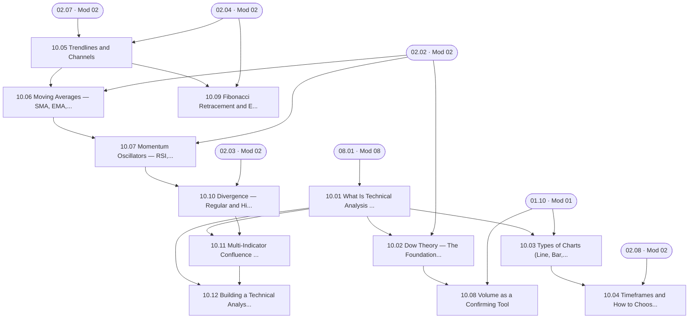
```mermaid
flowchart TD
    L08_01(["08.01 · Mod 08"])
    L02_02(["02.02 · Mod 02"])
    L01_10(["01.10 · Mod 01"])
    L02_08(["02.08 · Mod 02"])
    L02_07(["02.07 · Mod 02"])
    L02_04(["02.04 · Mod 02"])
    L02_03(["02.03 · Mod 02"])
    L10_01["10.01 What Is Technical Analysis ..."]
    L10_02["10.02 Dow Theory — The Foundation..."]
    L10_03["10.03 Types of Charts (Line, Bar,..."]
    L10_04["10.04 Timeframes and How to Choos..."]
    L10_05["10.05 Trendlines and Channels"]
    L10_06["10.06 Moving Averages — SMA, EMA,..."]
    L10_07["10.07 Momentum Oscillators — RSI,..."]
    L10_08["10.08 Volume as a Confirming Tool"]
    L10_09["10.09 Fibonacci Retracement and E..."]
    L10_10["10.10 Divergence — Regular and Hi..."]
    L10_11["10.11 Multi-Indicator Confluence ..."]
    L10_12["10.12 Building a Technical Analys..."]
    L08_01 --> L10_01
    L10_01 --> L10_02
    L02_02 --> L10_02
    L10_01 --> L10_03
    L01_10 --> L10_03
    L10_03 --> L10_04
    L02_08 --> L10_04
    L02_07 --> L10_05
    L02_04 --> L10_05
    L10_05 --> L10_06
    L02_02 --> L10_06
    L10_06 --> L10_07
    L02_02 --> L10_07
    L10_02 --> L10_08
    L01_10 --> L10_08
    L10_05 --> L10_09
    L02_04 --> L10_09
    L10_07 --> L10_10
    L02_03 --> L10_10
    L10_01 --> L10_11
    L10_10 --> L10_11
    L10_01 --> L10_12
    L10_11 --> L10_12
```

| Lesson | Prerequisites | Related Topics | Next Topic | Advanced Topics | Key Misconception |
|---|---|---|---|---|---|
| [`[10.01]`](docs/10_Technical_Analysis/10.01_What_Is_Technical_Analysis_and_Does_It_Work.md) What Is Technical Analysis and Does It Work | `[08.01]` | `[02.01]`, `[02.02]`, `[02.04]`, `[02.08]` | `[10.02]` | `[10.03]`, `[10.11]`, `[10.12]` | Technical analysis can predict exact future prices with certainty. |
| [`[10.02]`](docs/10_Technical_Analysis/10.02_Dow_Theory.md) Dow Theory — The Foundation of TA | `[10.01]`, `[02.02]` | `[04.05]`, `[02.08]`, `[02.01]`, `[14.01]` | `[10.03]` | `[10.08]` | Dow Theory is a specific, mechanical trading system with precise buy/sell s... |
| [`[10.03]`](docs/10_Technical_Analysis/10.03_Types_of_Charts.md) Types of Charts (Line, Bar, Candlestick, Renko, Heikin-Ashi) | `[01.10]`, `[10.01]` | `[11.09]`, `[02.04]` | `[10.04]` | `[11.01]`, `[15.01]` | Candlestick and bar charts show different underlying data. |
| [`[10.04]`](docs/10_Technical_Analysis/10.04_Timeframes_and_How_to_Choose_One.md) Timeframes and How to Choose One | `[02.08]`, `[10.03]` | `[01.04]`, `[10.02]` | `[10.05]` | — | A shorter timeframe always provides more accurate or useful information. |
| [`[10.05]`](docs/10_Technical_Analysis/10.05_Trendlines_and_Channels.md) Trendlines and Channels | `[02.07]`, `[02.04]` | `[02.05]`, `[02.03]`, `[10.08]`, `[10.11]` | `[10.06]` | `[10.09]`, `[12.04]`, `[12.07]` | A trendline break always signals an immediate, confirmed trend reversal. |
| [`[10.06]`](docs/10_Technical_Analysis/10.06_Moving_Averages_SMA_EMA_WMA.md) Moving Averages — SMA, EMA, WMA | `[02.02]`, `[10.05]` | `[02.01]`, `[10.04]`, `[10.11]`, `[24.02]` | `[10.07]` | `[24.02]`, `[24.08]` | A moving average crossover guarantees a valid, tradeable trend signal. |
| [`[10.07]`](docs/10_Technical_Analysis/10.07_Momentum_Oscillators_RSI_Stochastic_MACD.md) Momentum Oscillators — RSI, Stochastic, MACD | `[10.06]`, `[02.02]` | `[10.05]`, `[02.01]`, `[10.10]`, `[10.02]` | `[10.08]` | `[10.10]`, `[24.03]` | Overbought means the price must fall soon. |
| [`[10.08]`](docs/10_Technical_Analysis/10.08_Volume_as_a_Confirming_Tool.md) Volume as a Confirming Tool | `[10.02]`, `[01.10]` | `[02.04]`, `[02.06]`, `[02.05]`, `[14.05]` | `[10.09]` | `[12.05]`, `[14.01]` | High volume always confirms a genuine, sustainable price move. |
| [`[10.09]`](docs/10_Technical_Analysis/10.09_Fibonacci_Retracement_and_Extension.md) Fibonacci Retracement and Extension | `[02.04]`, `[10.05]` | `[10.11]`, `[02.07]`, `[10.08]`, `[10.07]` | `[10.10]` | `[13.05]`, `[18.06]`, `[19.04]` | Fibonacci levels are mathematically proven to have unique predictive power... |
| [`[10.10]`](docs/10_Technical_Analysis/10.10_Divergence_Regular_and_Hidden.md) Divergence — Regular and Hidden | `[10.07]`, `[02.03]` | `[02.05]` | `[10.11]` | — | Divergence guarantees an immediate trend reversal or continuation once iden... |
| [`[10.11]`](docs/10_Technical_Analysis/10.11_Multi_Indicator_Confluence_and_Its_Pitfalls.md) Multi-Indicator Confluence and Its Pitfalls | `[10.01]`, `[10.10]` | `[10.05]`, `[10.08]`, `[10.09]`, `[10.07]` | `[10.12]` | `[11.08]` | More indicators on a chart always means more analytical rigor and confidence. |
| [`[10.12]`](docs/10_Technical_Analysis/10.12_Building_a_Technical_Analysis_Checklist.md) Building a Technical Analysis Checklist | `[10.01]`, `[10.11]` | `[10.03]`, `[10.04]`, `[10.05]`, `[10.06]` | `[11.01]` | `[13.10]`, `[14.06]`, `[18.07]` | A checklist guarantees successful trades. |

### Module 11 — Candlesticks

[Module Index](docs/11_Candlesticks/_Index.md)

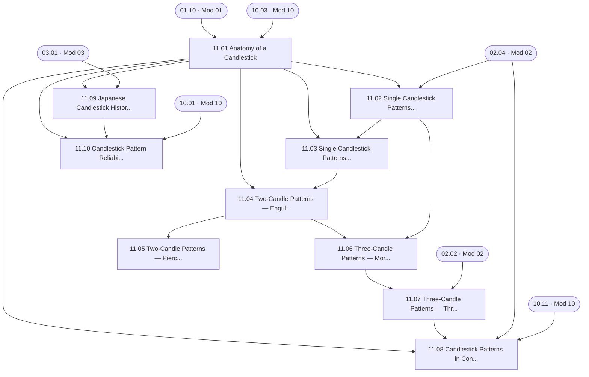
```mermaid
flowchart TD
    L01_10(["01.10 · Mod 01"])
    L10_03(["10.03 · Mod 10"])
    L02_04(["02.04 · Mod 02"])
    L02_02(["02.02 · Mod 02"])
    L10_11(["10.11 · Mod 10"])
    L03_01(["03.01 · Mod 03"])
    L10_01(["10.01 · Mod 10"])
    L11_01["11.01 Anatomy of a Candlestick"]
    L11_02["11.02 Single Candlestick Patterns..."]
    L11_03["11.03 Single Candlestick Patterns..."]
    L11_04["11.04 Two-Candle Patterns — Engul..."] --> L11_05["11.05 Two-Candle Patterns — Pierc..."]
    L11_06["11.06 Three-Candle Patterns — Mor..."]
    L11_07["11.07 Three-Candle Patterns — Thr..."]
    L11_08["11.08 Candlestick Patterns in Con..."]
    L11_09["11.09 Japanese Candlestick Histor..."]
    L11_10["11.10 Candlestick Pattern Reliabi..."]
    L01_10 --> L11_01
    L10_03 --> L11_01
    L11_01 --> L11_02
    L02_04 --> L11_02
    L11_01 --> L11_03
    L11_02 --> L11_03
    L11_01 --> L11_04
    L11_03 --> L11_04
    L11_04 --> L11_06
    L11_02 --> L11_06
    L11_06 --> L11_07
    L02_02 --> L11_07
    L11_01 --> L11_08
    L11_07 --> L11_08
    L02_04 --> L11_08
    L10_11 --> L11_08
    L11_01 --> L11_09
    L03_01 --> L11_09
    L11_01 --> L11_10
    L11_09 --> L11_10
    L10_01 --> L11_10
```

| Lesson | Prerequisites | Related Topics | Next Topic | Advanced Topics | Key Misconception |
|---|---|---|---|---|---|
| [`[11.01]`](docs/11_Candlesticks/11.01_Anatomy_of_a_Candlestick.md) Anatomy of a Candlestick | `[01.10]`, `[10.03]` | `[02.04]`, `[11.08]`, `[04.08]`, `[11.09]` | `[11.02]` | `[11.03]`, `[11.04]`, `[11.08]` | Candle color alone tells you everything you need to know. |
| [`[11.02]`](docs/11_Candlesticks/11.02_Single_Candlestick_Patterns_Doji_Hammer_Shooting_Star.md) Single Candlestick Patterns — Doji, Hammer, Shooting Star | `[11.01]`, `[02.04]` | `[10.11]`, `[10.08]` | `[11.03]` | `[11.06]` | A Hammer candle shape is always bullish, regardless of where it appears. |
| [`[11.03]`](docs/11_Candlesticks/11.03_Single_Candlestick_Patterns_Marubozu_Spinning_Top.md) Single Candlestick Patterns — Marubozu, Spinning Top | `[11.01]`, `[11.02]` | `[02.04]`, `[03.10]`, `[04.08]`, `[06.02]` | `[11.04]` | — | A Marubozu guarantees the trend will continue in the same direction indefin... |
| [`[11.04]`](docs/11_Candlesticks/11.04_Two_Candle_Patterns_Engulfing_Harami.md) Two-Candle Patterns — Engulfing, Harami | `[11.01]`, `[11.03]` | `[02.04]`, `[10.08]`, `[02.05]`, `[11.09]` | `[11.05]` | `[11.06]` | Any candle that's roughly bigger than the prior one qualifies as Engulfing. |
| [`[11.05]`](docs/11_Candlesticks/11.05_Two_Candle_Patterns_Piercing_Line_Dark_Cloud_Cover.md) Two-Candle Patterns — Piercing Line, Dark Cloud Cover | `[11.04]` | `[01.10]`, `[02.04]`, `[11.09]` | `[11.06]` | — | Piercing Line and Dark Cloud Cover are the same as Engulfing patterns. |
| [`[11.06]`](docs/11_Candlesticks/11.06_Three_Candle_Patterns_Morning_Star_Evening_Star.md) Three-Candle Patterns — Morning Star, Evening Star | `[11.04]`, `[11.02]` | `[02.02]`, `[02.04]`, `[10.08]`, `[10.11]` | `[11.07]` | — | Three-candle patterns require no additional confirmation beyond the pattern... |
| [`[11.07]`](docs/11_Candlesticks/11.07_Three_Candle_Patterns_Three_White_Soldiers_Three_Black_Crows.md) Three-Candle Patterns — Three White Soldiers, Three Black Crows | `[11.06]`, `[02.02]` | `[11.03]`, `[02.04]`, `[02.01]`, `[10.08]` | `[11.08]` | — | Three White Soldiers always signals a fresh, healthy bullish reversal. |
| [`[11.08]`](docs/11_Candlesticks/11.08_Candlestick_Patterns_in_Context.md) Candlestick Patterns in Context (Why Location Matters More Than Shape) | `[11.01]`, `[11.07]`, `[02.04]`, `[10.11]` | `[02.08]`, `[02.02]`, `[10.08]`, `[11.02]` | `[11.09]` | — | A perfectly-shaped candlestick pattern is inherently significant regardless... |
| [`[11.09]`](docs/11_Candlesticks/11.09_Japanese_Candlestick_History_Munehisa_Homma.md) Japanese Candlestick History — Munehisa Homma and Rice Trading | `[11.01]`, `[03.01]` | `[20.01]`, `[01.01]`, `[10.03]`, `[01.03]` | `[11.10]` | — | Munehisa Homma personally invented the exact candlestick charting technique... |
| [`[11.10]`](docs/11_Candlesticks/11.10_Candlestick_Pattern_Reliability.md) Candlestick Pattern Reliability — What Backtests Actually Show | `[11.01]`, `[11.09]`, `[10.01]` | `[11.08]`, `[10.11]`, `[11.02]` | `[12.01]` | — | Candlestick patterns have been definitively, scientifically proven to work... |

### Module 12 — Chart Patterns

[Module Index](docs/12_Chart_Patterns/_Index.md)

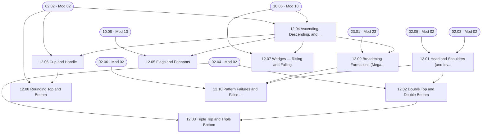
```mermaid
flowchart TD
    L02_03(["02.03 · Mod 02"])
    L02_05(["02.05 · Mod 02"])
    L02_04(["02.04 · Mod 02"])
    L10_05(["10.05 · Mod 10"])
    L02_02(["02.02 · Mod 02"])
    L10_08(["10.08 · Mod 10"])
    L23_01(["23.01 · Mod 23"])
    L02_06(["02.06 · Mod 02"])
    L12_01["12.01 Head and Shoulders (and Inv..."]
    L12_02["12.02 Double Top and Double Bottom"]
    L12_03["12.03 Triple Top and Triple Bottom"]
    L12_04["12.04 Ascending, Descending, and ..."]
    L12_05["12.05 Flags and Pennants"]
    L12_06["12.06 Cup and Handle"]
    L12_07["12.07 Wedges — Rising and Falling"]
    L12_08["12.08 Rounding Top and Bottom"]
    L12_09["12.09 Broadening Formations (Mega..."]
    L12_10["12.10 Pattern Failures and False ..."]
    L02_03 --> L12_01
    L02_05 --> L12_01
    L12_01 --> L12_02
    L02_04 --> L12_02
    L12_02 --> L12_03
    L02_04 --> L12_03
    L10_05 --> L12_04
    L02_02 --> L12_04
    L12_04 --> L12_05
    L10_08 --> L12_05
    L12_04 --> L12_06
    L02_02 --> L12_06
    L12_04 --> L12_07
    L10_05 --> L12_07
    L12_06 --> L12_08
    L02_02 --> L12_08
    L12_04 --> L12_09
    L23_01 --> L12_09
    L12_01 --> L12_10
    L12_09 --> L12_10
    L02_06 --> L12_10
```

| Lesson | Prerequisites | Related Topics | Next Topic | Advanced Topics | Key Misconception |
|---|---|---|---|---|---|
| [`[12.01]`](docs/12_Chart_Patterns/12.01_Head_and_Shoulders.md) Head and Shoulders (and Inverse) | `[02.03]`, `[02.05]` | `[02.02]`, `[10.08]`, `[11.08]` | `[12.02]` | `[12.10]` | The pattern is confirmed as soon as the right shoulder forms. |
| [`[12.02]`](docs/12_Chart_Patterns/12.02_Double_Top_and_Double_Bottom.md) Double Top and Double Bottom | `[02.04]`, `[12.01]` | `[10.08]`, `[10.02]`, `[02.05]` | `[12.03]` | `[17.04]` | Any two similar peaks automatically constitute a confirmed Double Top. |
| [`[12.03]`](docs/12_Chart_Patterns/12.03_Triple_Top_and_Triple_Bottom.md) Triple Top and Triple Bottom | `[12.02]`, `[02.04]` | `[12.01]`, `[11.10]` | `[12.04]` | — | Triple Top and Head and Shoulders are the same pattern with a different name. |
| [`[12.04]`](docs/12_Chart_Patterns/12.04_Triangles.md) Ascending, Descending, and Symmetrical Triangles | `[10.05]`, `[02.02]` | `[12.01]`, `[12.03]`, `[11.08]`, `[10.08]` | `[12.05]` | `[12.06]`, `[12.07]`, `[12.09]` | All triangles are reversal patterns, like Head and Shoulders or Double Top. |
| [`[12.05]`](docs/12_Chart_Patterns/12.05_Flags_and_Pennants.md) Flags and Pennants | `[12.04]`, `[10.08]` | `[10.05]`, `[11.03]`, `[03.10]`, `[11.10]` | `[12.06]` | — | Flags, Pennants, and Triangles are the same pattern with different names. |
| [`[12.06]`](docs/12_Chart_Patterns/12.06_Cup_and_Handle.md) Cup and Handle | `[12.04]`, `[02.02]` | `[12.05]`, `[10.08]` | `[12.07]` | `[12.08]` | Any decline-and-recovery back to the prior high qualifies as a Cup and Handle. |
| [`[12.07]`](docs/12_Chart_Patterns/12.07_Wedges_Rising_and_Falling.md) Wedges — Rising and Falling | `[12.04]`, `[10.05]` | `[10.10]`, `[02.02]`, `[11.08]`, `[10.08]` | `[12.08]` | — | A Rising Wedge, given its upward slope, must be a bullish pattern. |
| [`[12.08]`](docs/12_Chart_Patterns/12.08_Rounding_Top_and_Bottom.md) Rounding Top and Bottom | `[12.06]`, `[02.02]` | `[10.04]`, `[12.01]`, `[12.02]` | `[12.09]` | — | Rounding Bottom and Cup and Handle are the same pattern. |
| [`[12.09]`](docs/12_Chart_Patterns/12.09_Broadening_Formations.md) Broadening Formations (Megaphones) | `[12.04]`, `[23.01]` | `[12.07]`, `[06.06]`, `[12.01]`, `[11.10]` | `[12.10]` | `[18.04]` | Broadening Formations can be traded with the same confidence and measured-m... |
| [`[12.10]`](docs/12_Chart_Patterns/12.10_Pattern_Failures_and_False_Breakouts.md) Pattern Failures and False Breakouts | `[12.01]`, `[12.09]`, `[02.06]` | `[10.01]`, `[03.08]`, `[20.06]`, `[04.08]` | `[13.01]` | `[13.04]` | A well-identified, textbook chart pattern should never fail. |

### Module 13 — Price Action

[Module Index](docs/13_Price_Action/_Index.md)

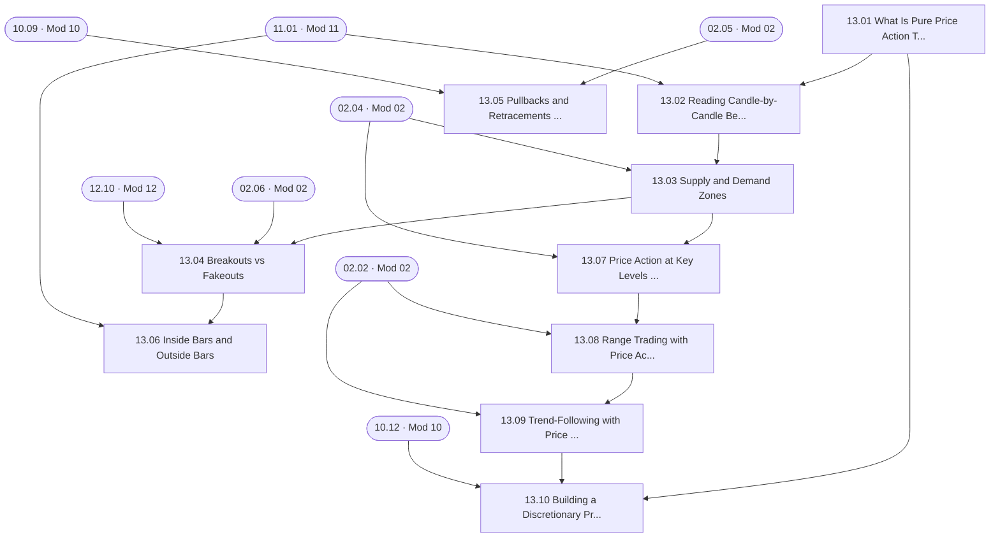
```mermaid
flowchart TD
    L11_01(["11.01 · Mod 11"])
    L02_04(["02.04 · Mod 02"])
    L02_06(["02.06 · Mod 02"])
    L12_10(["12.10 · Mod 12"])
    L02_05(["02.05 · Mod 02"])
    L10_09(["10.09 · Mod 10"])
    L02_02(["02.02 · Mod 02"])
    L10_12(["10.12 · Mod 10"])
    L13_01["13.01 What Is Pure Price Action T..."]
    L13_02["13.02 Reading Candle-by-Candle Be..."]
    L13_03["13.03 Supply and Demand Zones"]
    L13_04["13.04 Breakouts vs Fakeouts"]
    L13_05["13.05 Pullbacks and Retracements ..."]
    L13_06["13.06 Inside Bars and Outside Bars"]
    L13_07["13.07 Price Action at Key Levels ..."]
    L13_08["13.08 Range Trading with Price Ac..."]
    L13_09["13.09 Trend-Following with Price ..."]
    L13_10["13.10 Building a Discretionary Pr..."]
    L13_01 --> L13_02
    L11_01 --> L13_02
    L13_02 --> L13_03
    L02_04 --> L13_03
    L13_03 --> L13_04
    L02_06 --> L13_04
    L12_10 --> L13_04
    L02_05 --> L13_05
    L10_09 --> L13_05
    L13_04 --> L13_06
    L11_01 --> L13_06
    L13_03 --> L13_07
    L02_04 --> L13_07
    L13_07 --> L13_08
    L02_02 --> L13_08
    L13_08 --> L13_09
    L02_02 --> L13_09
    L13_01 --> L13_10
    L13_09 --> L13_10
    L10_12 --> L13_10
```

| Lesson | Prerequisites | Related Topics | Next Topic | Advanced Topics | Key Misconception |
|---|---|---|---|---|---|
| [`[13.01]`](docs/13_Price_Action/13.01_What_Is_Pure_Price_Action_Trading.md) What Is Pure Price Action Trading | — | `[10.06]`, `[10.07]`, `[11.01]`, `[11.02]` | `[13.02]` | `[13.10]` | Price action trading requires ignoring everything taught in Modules 11-12. |
| [`[13.02]`](docs/13_Price_Action/13.02_Reading_Candle_by_Candle_Behavior.md) Reading Candle-by-Candle Behavior | `[13.01]`, `[11.01]` | `[11.03]`, `[10.10]`, `[10.02]`, `[11.09]` | `[13.03]` | — | A single candle's color (bullish/bearish) is the most important piece of in... |
| [`[13.03]`](docs/13_Price_Action/13.03_Supply_and_Demand_Zones.md) Supply and Demand Zones | `[02.04]`, `[13.02]` | `[02.06]`, `[10.02]` | `[13.04]` | `[13.07]`, `[16.03]`, `[18.03]` | Supply/demand zones and support/resistance zones are identical concepts. |
| [`[13.04]`](docs/13_Price_Action/13.04_Breakouts_vs_Fakeouts.md) Breakouts vs Fakeouts | `[02.06]`, `[12.10]`, `[13.03]` | `[10.08]`, `[02.04]`, `[10.05]`, `[11.02]` | `[13.05]` | `[13.06]`, `[14.03]`, `[17.05]` | Every breakout should be entered immediately upon the first close beyond th... |
| [`[13.05]`](docs/13_Price_Action/13.05_Pullbacks_and_Retracements_vs_Reversals.md) Pullbacks and Retracements vs Reversals | `[02.05]`, `[10.09]` | `[02.03]`, `[10.08]`, `[13.02]`, `[10.11]` | `[13.06]` | — | A pullback and a retracement are different concepts requiring different ana... |
| [`[13.06]`](docs/13_Price_Action/13.06_Inside_Bars_and_Outside_Bars.md) Inside Bars and Outside Bars | `[11.01]`, `[13.04]` | `[12.04]`, `[12.05]`, `[11.04]`, `[10.08]` | `[13.07]` | — | Inside Bar and Outside Bar patterns are the same as Harami and Engulfing pa... |
| [`[13.07]`](docs/13_Price_Action/13.07_Price_Action_at_Key_Levels.md) Price Action at Key Levels (Round Numbers, Prior Day High/Low) | `[02.04]`, `[13.03]` | `[02.06]`, `[10.11]`, `[13.02]`, `[13.04]` | `[13.08]` | `[15.04]` | Round numbers only matter because of superstition, with no genuine trading... |
| [`[13.08]`](docs/13_Price_Action/13.08_Range_Trading_with_Price_Action.md) Range Trading with Price Action | `[02.02]`, `[13.07]` | `[02.04]`, `[13.02]`, `[13.04]`, `[13.06]` | `[13.09]` | `[17.03]` | Range trading is a lower-skill, easier approach than trend trading. |
| [`[13.09]`](docs/13_Price_Action/13.09_Trend_Following_with_Price_Action.md) Trend-Following with Price Action | `[02.02]`, `[13.08]` | `[13.05]`, `[02.05]`, `[02.01]`, `[10.02]` | `[13.10]` | — | Trend-following and range trading use the same underlying approach. |
| [`[13.10]`](docs/13_Price_Action/13.10_Building_a_Discretionary_Price_Action_Playbook.md) Building a Discretionary Price Action Playbook | `[13.01]`, `[13.09]`, `[10.12]` | `[13.02]`, `[13.03]`, `[13.04]`, `[13.05]` | `[14.01]` | `[16.06]`, `[24.01]`, `[29.02]` | Price action trading is too fluid and discretionary to be structured into a... |

### Module 14 — Volume

[Module Index](docs/14_Volume/_Index.md)

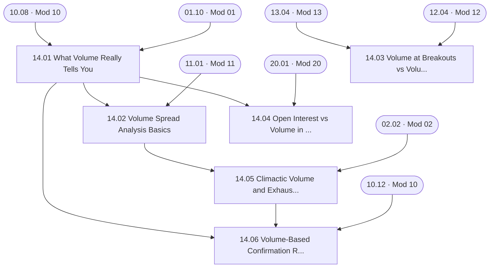
```mermaid
flowchart TD
    L10_08(["10.08 · Mod 10"])
    L01_10(["01.10 · Mod 01"])
    L11_01(["11.01 · Mod 11"])
    L13_04(["13.04 · Mod 13"])
    L12_04(["12.04 · Mod 12"])
    L20_01(["20.01 · Mod 20"])
    L02_02(["02.02 · Mod 02"])
    L10_12(["10.12 · Mod 10"])
    L14_01["14.01 What Volume Really Tells You"]
    L14_02["14.02 Volume Spread Analysis Basics"]
    L14_03["14.03 Volume at Breakouts vs Volu..."]
    L14_04["14.04 Open Interest vs Volume in ..."]
    L14_05["14.05 Climactic Volume and Exhaus..."]
    L14_06["14.06 Volume-Based Confirmation R..."]
    L10_08 --> L14_01
    L01_10 --> L14_01
    L14_01 --> L14_02
    L11_01 --> L14_02
    L13_04 --> L14_03
    L12_04 --> L14_03
    L14_01 --> L14_04
    L20_01 --> L14_04
    L14_02 --> L14_05
    L02_02 --> L14_05
    L14_01 --> L14_06
    L14_05 --> L14_06
    L10_12 --> L14_06
```

| Lesson | Prerequisites | Related Topics | Next Topic | Advanced Topics | Key Misconception |
|---|---|---|---|---|---|
| [`[14.01]`](docs/14_Volume/14.01_What_Volume_Really_Tells_You.md) What Volume Really Tells You | `[10.08]`, `[01.10]` | `[01.04]`, `[11.02]`, `[11.01]`, `[01.07]` | `[14.02]` | `[14.04]`, `[14.06]`, `[15.01]` | High volume always means bullish activity. |
| [`[14.02]`](docs/14_Volume/14.02_Volume_Spread_Analysis_Basics.md) Volume Spread Analysis Basics | `[14.01]`, `[11.01]` | `[02.04]`, `[17.01]`, `[13.03]`, `[11.08]` | `[14.03]` | `[14.05]` | VSA is a completely independent framework unrelated to Wyckoff's work. |
| [`[14.03]`](docs/14_Volume/14.03_Volume_at_Breakouts_vs_Volume_in_Ranges.md) Volume at Breakouts vs Volume in Ranges | `[13.04]`, `[12.04]` | `[13.08]`, `[12.01]`, `[12.10]` | `[14.04]` | `[24.04]` | Declining volume during a range is a bearish warning sign requiring action. |
| [`[14.04]`](docs/14_Volume/14.04_Open_Interest_vs_Volume_in_Derivatives.md) Open Interest vs Volume in Derivatives | `[14.01]`, `[20.01]` | `[21.11]`, `[01.10]`, `[03.08]`, `[01.05]` | `[14.05]` | `[21.11]` | Volume and Open Interest measure the same thing. |
| [`[14.05]`](docs/14_Volume/14.05_Climactic_Volume_and_Exhaustion.md) Climactic Volume and Exhaustion | `[14.02]`, `[02.02]` | `[11.07]`, `[13.05]`, `[10.08]`, `[13.02]` | `[14.06]` | `[17.01]` | Any unusually high volume day represents a climax. |
| [`[14.06]`](docs/14_Volume/14.06_Volume_Based_Confirmation_Rules.md) Volume-Based Confirmation Rules | `[14.01]`, `[14.05]`, `[10.12]` | `[14.02]`, `[14.03]`, `[14.04]`, `[13.10]` | `[15.01]` | `[16.06]` | Volume analysis is a separate, standalone skill unrelated to Modules 10-13'... |

### Module 15 — Market Profile

[Module Index](docs/15_Market_Profile/_Index.md)

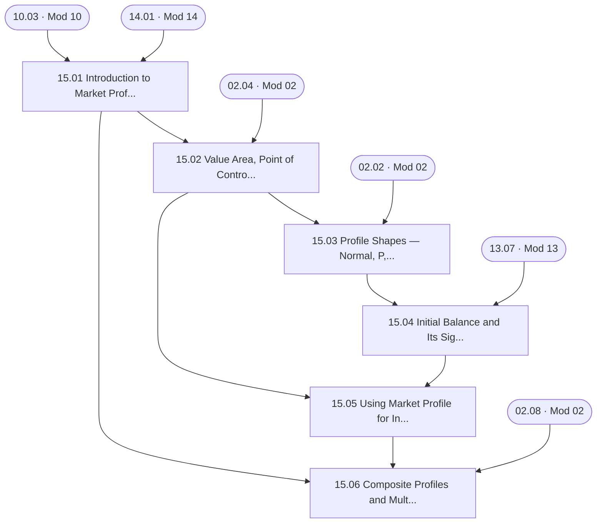
```mermaid
flowchart TD
    L10_03(["10.03 · Mod 10"])
    L14_01(["14.01 · Mod 14"])
    L02_04(["02.04 · Mod 02"])
    L02_02(["02.02 · Mod 02"])
    L13_07(["13.07 · Mod 13"])
    L02_08(["02.08 · Mod 02"])
    L15_01["15.01 Introduction to Market Prof..."]
    L15_02["15.02 Value Area, Point of Contro..."]
    L15_03["15.03 Profile Shapes — Normal, P,..."]
    L15_04["15.04 Initial Balance and Its Sig..."]
    L15_05["15.05 Using Market Profile for In..."]
    L15_06["15.06 Composite Profiles and Mult..."]
    L10_03 --> L15_01
    L14_01 --> L15_01
    L15_01 --> L15_02
    L02_04 --> L15_02
    L15_02 --> L15_03
    L02_02 --> L15_03
    L15_03 --> L15_04
    L13_07 --> L15_04
    L15_02 --> L15_05
    L15_04 --> L15_05
    L15_01 --> L15_06
    L15_05 --> L15_06
    L02_08 --> L15_06
```

| Lesson | Prerequisites | Related Topics | Next Topic | Advanced Topics | Key Misconception |
|---|---|---|---|---|---|
| [`[15.01]`](docs/15_Market_Profile/15.01_Introduction_to_Market_Profile.md) Introduction to Market Profile (TPO) | `[10.03]`, `[14.01]` | `[02.04]`, `[13.03]`, `[03.08]` | `[15.02]` | `[15.06]`, `[16.01]` | Market Profile is just a different visual style for the same candlestick data. |
| [`[15.02]`](docs/15_Market_Profile/15.02_Value_Area_Point_of_Control_and_Range.md) Value Area, Point of Control, and Range | `[15.01]`, `[02.04]` | `[02.02]` | `[15.03]` | `[15.05]`, `[16.02]` | The Point of Control is the same as the session's closing price. |
| [`[15.03]`](docs/15_Market_Profile/15.03_Profile_Shapes.md) Profile Shapes — Normal, P, b, Trend Day | `[15.02]`, `[02.02]` | `[15.01]`, `[02.01]`, `[15.05]`, `[06.02]` | `[15.04]` | — | A session's profile shape is fully determined and predictable from the very... |
| [`[15.04]`](docs/15_Market_Profile/15.04_Initial_Balance_and_Its_Significance.md) Initial Balance and Its Significance | `[15.03]`, `[13.07]` | `[13.02]`, `[14.03]`, `[06.02]`, `[13.09]` | `[15.05]` | — | Initial Balance and Opening Range (`[13.07]`) are unrelated concepts. |
| [`[15.05]`](docs/15_Market_Profile/15.05_Using_Market_Profile_for_Intraday_Bias.md) Using Market Profile for Intraday Bias | `[15.02]`, `[15.04]` | `[13.08]`, `[13.09]`, `[15.03]`, `[15.01]` | `[15.06]` | — | Open type is fully determined within the very first minute of trading. |
| [`[15.06]`](docs/15_Market_Profile/15.06_Composite_Profiles_and_Multi_Day_Analysis.md) Composite Profiles and Multi-Day Analysis | `[15.01]`, `[15.05]`, `[02.08]` | `[15.03]`, `[10.04]` | `[16.01]` | `[16.05]` | Composite profiles are just single-session profiles viewed over a longer pe... |

### Module 16 — Volume Profile

[Module Index](docs/16_Volume_Profile/_Index.md)

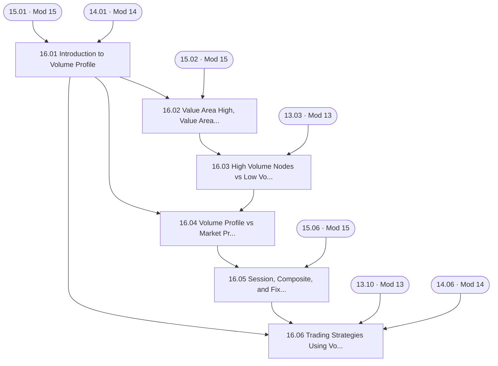
```mermaid
flowchart TD
    L15_01(["15.01 · Mod 15"])
    L14_01(["14.01 · Mod 14"])
    L15_02(["15.02 · Mod 15"])
    L13_03(["13.03 · Mod 13"])
    L15_06(["15.06 · Mod 15"])
    L13_10(["13.10 · Mod 13"])
    L14_06(["14.06 · Mod 14"])
    L16_01["16.01 Introduction to Volume Profile"]
    L16_02["16.02 Value Area High, Value Area..."]
    L16_03["16.03 High Volume Nodes vs Low Vo..."]
    L16_04["16.04 Volume Profile vs Market Pr..."]
    L16_05["16.05 Session, Composite, and Fix..."]
    L16_06["16.06 Trading Strategies Using Vo..."]
    L15_01 --> L16_01
    L14_01 --> L16_01
    L16_01 --> L16_02
    L15_02 --> L16_02
    L16_02 --> L16_03
    L13_03 --> L16_03
    L16_01 --> L16_04
    L16_03 --> L16_04
    L16_04 --> L16_05
    L15_06 --> L16_05
    L16_01 --> L16_06
    L16_05 --> L16_06
    L13_10 --> L16_06
    L14_06 --> L16_06
```

| Lesson | Prerequisites | Related Topics | Next Topic | Advanced Topics | Key Misconception |
|---|---|---|---|---|---|
| [`[16.01]`](docs/16_Volume_Profile/16.01_Introduction_to_Volume_Profile.md) Introduction to Volume Profile | `[15.01]`, `[14.01]` | `[02.06]`, `[15.02]`, `[15.03]` | `[16.02]` | `[16.04]`, `[16.06]` | Volume Profile and Market Profile always produce identical results. |
| [`[16.02]`](docs/16_Volume_Profile/16.02_Value_Area_High_Low_POC.md) Value Area High, Value Area Low, POC | `[16.01]`, `[15.02]` | `[02.04]`, `[15.05]`, `[15.06]` | `[16.03]` | — | VAH/VAL/POC mean exactly the same thing in Volume Profile and Market Profile. |
| [`[16.03]`](docs/16_Volume_Profile/16.03_High_Volume_Nodes_vs_Low_Volume_Nodes.md) High Volume Nodes vs Low Volume Nodes | `[16.02]`, `[13.03]` | `[13.04]`, `[02.04]`, `[14.03]`, `[16.01]` | `[16.04]` | — | Only the POC matters within a Volume Profile; internal HVN/LVN structure is... |
| [`[16.04]`](docs/16_Volume_Profile/16.04_Volume_Profile_vs_Market_Profile.md) Volume Profile vs Market Profile — Key Differences | `[16.01]`, `[16.03]` | `[15.03]`, `[15.05]`, `[14.01]`, `[15.01]` | `[16.05]` | — | One framework is universally, objectively superior to the other. |
| [`[16.05]`](docs/16_Volume_Profile/16.05_Session_Composite_and_Fixed_Range_Volume_Profiles.md) Session, Composite, and Fixed Range Volume Profiles | `[16.04]`, `[15.06]` | `[10.04]`, `[15.01]`, `[15.05]`, `[10.09]` | `[16.06]` | — | Session, Composite, and Fixed Range profiles are just cosmetic display opti... |
| [`[16.06]`](docs/16_Volume_Profile/16.06_Trading_Strategies_Using_Volume_Profile.md) Trading Strategies Using Volume Profile | `[16.01]`, `[16.05]`, `[13.10]`, `[14.06]` | `[13.04]`, `[16.03]`, `[10.11]`, `[02.04]` | `[17.01]` | — | Volume Profile alone is a complete, standalone trading system. |

### Module 17 — Wyckoff

[Module Index](docs/17_Wyckoff/_Index.md)

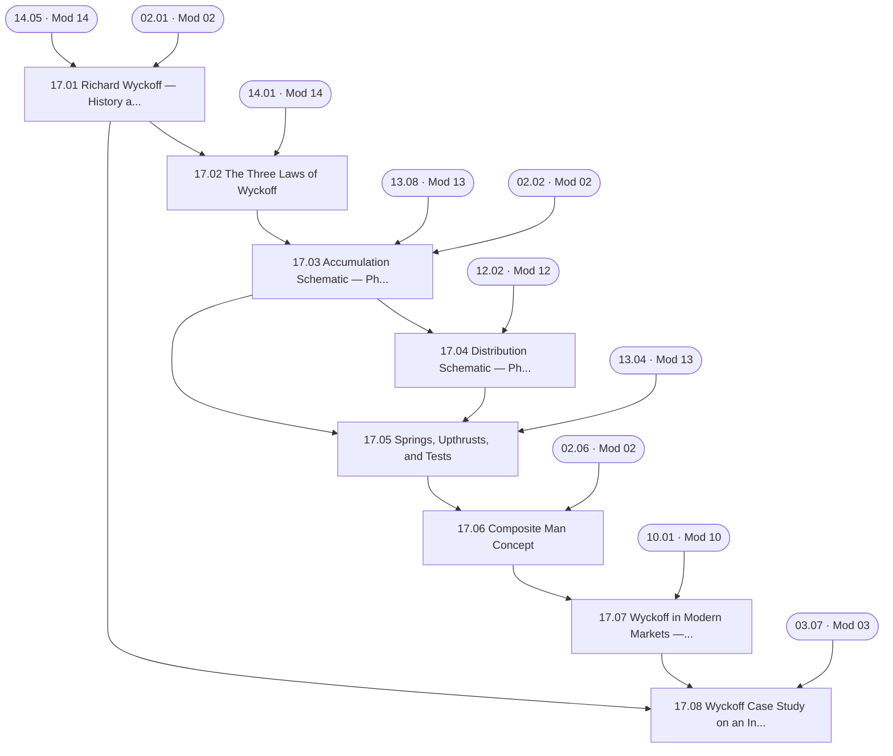
```mermaid
flowchart TD
    L14_05(["14.05 · Mod 14"])
    L02_01(["02.01 · Mod 02"])
    L14_01(["14.01 · Mod 14"])
    L13_08(["13.08 · Mod 13"])
    L02_02(["02.02 · Mod 02"])
    L12_02(["12.02 · Mod 12"])
    L13_04(["13.04 · Mod 13"])
    L02_06(["02.06 · Mod 02"])
    L10_01(["10.01 · Mod 10"])
    L03_07(["03.07 · Mod 03"])
    L17_01["17.01 Richard Wyckoff — History a..."]
    L17_02["17.02 The Three Laws of Wyckoff"]
    L17_03["17.03 Accumulation Schematic — Ph..."]
    L17_04["17.04 Distribution Schematic — Ph..."]
    L17_05["17.05 Springs, Upthrusts, and Tests"]
    L17_06["17.06 Composite Man Concept"]
    L17_07["17.07 Wyckoff in Modern Markets —..."]
    L17_08["17.08 Wyckoff Case Study on an In..."]
    L14_05 --> L17_01
    L02_01 --> L17_01
    L17_01 --> L17_02
    L14_01 --> L17_02
    L17_02 --> L17_03
    L13_08 --> L17_03
    L02_02 --> L17_03
    L17_03 --> L17_04
    L12_02 --> L17_04
    L17_03 --> L17_05
    L17_04 --> L17_05
    L13_04 --> L17_05
    L17_05 --> L17_06
    L02_06 --> L17_06
    L17_06 --> L17_07
    L10_01 --> L17_07
    L17_01 --> L17_08
    L17_07 --> L17_08
    L03_07 --> L17_08
```

| Lesson | Prerequisites | Related Topics | Next Topic | Advanced Topics | Key Misconception |
|---|---|---|---|---|---|
| [`[17.01]`](docs/17_Wyckoff/17.01_Richard_Wyckoff_History_and_Philosophy.md) Richard Wyckoff — History and Philosophy | `[14.05]`, `[02.01]` | `[10.02]`, `[17.06]`, `[10.01]`, `[03.07]` | `[17.02]` | `[17.08]` | Wyckoff is just another chart pattern system, unrelated to Module 12's clas... |
| [`[17.02]`](docs/17_Wyckoff/17.02_The_Three_Laws_of_Wyckoff.md) The Three Laws of Wyckoff | `[17.01]`, `[14.01]` | `[02.01]`, `[14.05]`, `[17.04]` | `[17.03]` | — | The Law of Cause and Effect provides an exact, guaranteed price target. |
| [`[17.03]`](docs/17_Wyckoff/17.03_Accumulation_Schematic_Phases_A_to_E.md) Accumulation Schematic — Phases A to E | `[17.02]`, `[13.08]`, `[02.02]` | `[17.06]`, `[17.05]`, `[14.05]`, `[17.01]` | `[17.04]` | `[17.05]`, `[19.02]` | Every accumulation structure follows this exact five-phase sequence precisely. |
| [`[17.04]`](docs/17_Wyckoff/17.04_Distribution_Schematic_Phases_A_to_E.md) Distribution Schematic — Phases A to E | `[17.03]`, `[12.02]` | `[12.08]`, `[17.06]`, `[14.05]`, `[17.01]` | `[17.05]` | — | Distribution and Accumulation are unrelated, independent concepts. |
| [`[17.05]`](docs/17_Wyckoff/17.05_Springs_Upthrusts_and_Tests.md) Springs, Upthrusts, and Tests | `[17.03]`, `[17.04]`, `[13.04]` | `[17.01]`, `[06.09]` | `[17.06]` | `[19.05]` | A Spring always occurs on high volume. |
| [`[17.06]`](docs/17_Wyckoff/17.06_Composite_Man_Concept.md) Composite Man Concept | `[17.05]`, `[02.06]` | `[17.03]`, `[17.04]`, `[03.07]`, `[17.01]` | `[17.07]` | `[18.01]` | The Composite Man is a literal, real, single entity controlling markets. |
| [`[17.07]`](docs/17_Wyckoff/17.07_Wyckoff_in_Modern_Markets.md) Wyckoff in Modern Markets — Does It Still Work | `[17.06]`, `[10.01]` | `[02.06]`, `[17.05]`, `[18.01]` | `[17.08]` | `[18.01]` | Wyckoff's framework is entirely obsolete since it predates electronic markets. |
| [`[17.08]`](docs/17_Wyckoff/17.08_Wyckoff_Case_Study_on_an_Indian_Stock.md) Wyckoff Case Study on an Indian Stock | `[17.01]`, `[17.07]`, `[03.07]` | `[17.02]`, `[17.03]`, `[17.05]`, `[17.06]` | `[18.01]` | — | This illustrative XYZ case study represents a real stock recommendation or... |

### Module 18 — Smart Money

[Module Index](docs/18_Smart_Money/_Index.md)

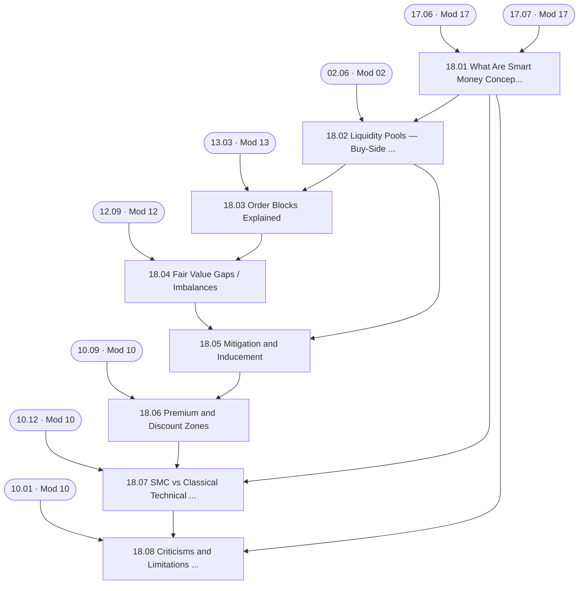
```mermaid
flowchart TD
    L17_06(["17.06 · Mod 17"])
    L17_07(["17.07 · Mod 17"])
    L02_06(["02.06 · Mod 02"])
    L13_03(["13.03 · Mod 13"])
    L12_09(["12.09 · Mod 12"])
    L10_09(["10.09 · Mod 10"])
    L10_12(["10.12 · Mod 10"])
    L10_01(["10.01 · Mod 10"])
    L18_01["18.01 What Are Smart Money Concep..."]
    L18_02["18.02 Liquidity Pools — Buy-Side ..."]
    L18_03["18.03 Order Blocks Explained"]
    L18_04["18.04 Fair Value Gaps / Imbalances"]
    L18_05["18.05 Mitigation and Inducement"]
    L18_06["18.06 Premium and Discount Zones"]
    L18_07["18.07 SMC vs Classical Technical ..."]
    L18_08["18.08 Criticisms and Limitations ..."]
    L17_06 --> L18_01
    L17_07 --> L18_01
    L18_01 --> L18_02
    L02_06 --> L18_02
    L18_02 --> L18_03
    L13_03 --> L18_03
    L18_03 --> L18_04
    L12_09 --> L18_04
    L18_04 --> L18_05
    L18_02 --> L18_05
    L18_05 --> L18_06
    L10_09 --> L18_06
    L18_01 --> L18_07
    L18_06 --> L18_07
    L10_12 --> L18_07
    L18_01 --> L18_08
    L18_07 --> L18_08
    L10_01 --> L18_08
```

| Lesson | Prerequisites | Related Topics | Next Topic | Advanced Topics | Key Misconception |
|---|---|---|---|---|---|
| [`[18.01]`](docs/18_Smart_Money/18.01_What_Are_Smart_Money_Concepts.md) What Are Smart Money Concepts (SMC) | `[17.06]`, `[17.07]` | `[18.03]`, `[18.04]`, `[18.05]`, `[18.06]` | `[18.02]` | `[18.07]`, `[18.08]` | SMC is a completely new discovery, unrelated to any prior technical analysi... |
| [`[18.02]`](docs/18_Smart_Money/18.02_Liquidity_Pools_Buy_Side_and_Sell_Side.md) Liquidity Pools — Buy-Side and Sell-Side | `[18.01]`, `[02.06]` | `[17.05]`, `[02.05]`, `[13.06]`, `[13.04]` | `[18.03]` | `[18.05]`, `[19.06]` | Every price move beyond a swing high/low is a deliberate liquidity grab. |
| [`[18.03]`](docs/18_Smart_Money/18.03_Order_Blocks_Explained.md) Order Blocks Explained | `[18.02]`, `[13.03]` | `[18.01]` | `[18.04]` | — | Order block identification is fully objective, with no subjectivity involved. |
| [`[18.04]`](docs/18_Smart_Money/18.04_Fair_Value_Gaps_Imbalances.md) Fair Value Gaps / Imbalances | `[18.03]`, `[12.09]` | `[15.01]`, `[18.02]`, `[18.01]` | `[18.05]` | — | FVGs are the same thing as classical overnight gaps. |
| [`[18.05]`](docs/18_Smart_Money/18.05_Mitigation_and_Inducement.md) Mitigation and Inducement | `[18.04]`, `[18.02]` | `[18.03]`, `[18.01]`, `[17.05]` | `[18.06]` | — | Every losing trade was the result of inducement. |
| [`[18.06]`](docs/18_Smart_Money/18.06_Premium_and_Discount_Zones.md) Premium and Discount Zones | `[18.05]`, `[10.09]` | `[18.03]`, `[18.04]`, `[18.01]`, `[17.02]` | `[18.07]` | — | Premium and discount zones are a standalone, sufficient trading signal. |
| [`[18.07]`](docs/18_Smart_Money/18.07_SMC_vs_Classical_Technical_Analysis.md) SMC vs Classical Technical Analysis | `[18.01]`, `[18.06]`, `[10.12]` | `[13.03]`, `[17.05]`, `[10.09]`, `[18.05]` | `[18.08]` | — | SMC and classical TA are entirely separate, competing systems. |
| [`[18.08]`](docs/18_Smart_Money/18.08_Criticisms_and_Limitations_of_SMC.md) Criticisms and Limitations of SMC | `[18.01]`, `[18.07]`, `[10.01]` | `[18.05]`, `[18.03]` | `[19.01]` | `[19.08]` | A chart showing a 'perfect' SMC setup after the fact proves the framework w... |

### Module 19 — ICT

[Module Index](docs/19_ICT/_Index.md)

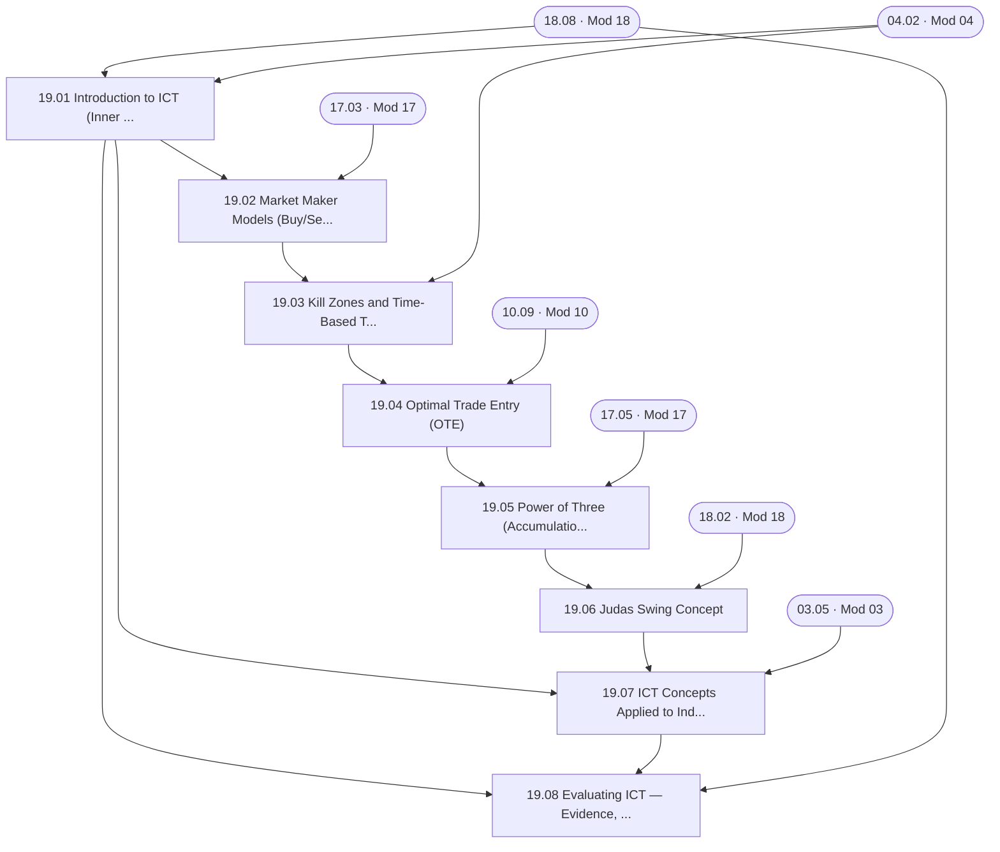
```mermaid
flowchart TD
    L18_08(["18.08 · Mod 18"])
    L04_02(["04.02 · Mod 04"])
    L17_03(["17.03 · Mod 17"])
    L10_09(["10.09 · Mod 10"])
    L17_05(["17.05 · Mod 17"])
    L18_02(["18.02 · Mod 18"])
    L03_05(["03.05 · Mod 03"])
    L19_01["19.01 Introduction to ICT (Inner ..."]
    L19_02["19.02 Market Maker Models (Buy/Se..."]
    L19_03["19.03 Kill Zones and Time-Based T..."]
    L19_04["19.04 Optimal Trade Entry (OTE)"]
    L19_05["19.05 Power of Three (Accumulatio..."]
    L19_06["19.06 Judas Swing Concept"]
    L19_07["19.07 ICT Concepts Applied to Ind..."]
    L19_08["19.08 Evaluating ICT — Evidence, ..."]
    L18_08 --> L19_01
    L04_02 --> L19_01
    L19_01 --> L19_02
    L17_03 --> L19_02
    L19_02 --> L19_03
    L04_02 --> L19_03
    L19_03 --> L19_04
    L10_09 --> L19_04
    L19_04 --> L19_05
    L17_05 --> L19_05
    L19_05 --> L19_06
    L18_02 --> L19_06
    L19_01 --> L19_07
    L19_06 --> L19_07
    L03_05 --> L19_07
    L19_01 --> L19_08
    L19_07 --> L19_08
    L18_08 --> L19_08
```

| Lesson | Prerequisites | Related Topics | Next Topic | Advanced Topics | Key Misconception |
|---|---|---|---|---|---|
| [`[19.01]`](docs/19_ICT/19.01_Introduction_to_ICT_Concepts.md) Introduction to ICT (Inner Circle Trader) Concepts | `[18.08]`, `[04.02]` | `[19.03]`, `[19.05]`, `[18.03]`, `[03.05]` | `[19.02]` | `[19.07]`, `[19.08]` | ICT is completely unrelated to SMC. |
| [`[19.02]`](docs/19_ICT/19.02_Market_Maker_Models.md) Market Maker Models (Buy/Sell Models) | `[19.01]`, `[17.03]` | `[18.02]`, `[18.04]`, `[17.05]`, `[18.03]` | `[19.03]` | — | Market Maker Models are an entirely novel ICT invention. |
| [`[19.03]`](docs/19_ICT/19.03_Kill_Zones_and_Time_Based_Trading.md) Kill Zones and Time-Based Trading | `[19.02]`, `[04.02]` | `[19.07]`, `[19.01]` | `[19.04]` | — | Kill Zones apply identically and precisely to every global market. |
| [`[19.04]`](docs/19_ICT/19.04_Optimal_Trade_Entry.md) Optimal Trade Entry (OTE) | `[19.03]`, `[10.09]` | `[19.02]`, `[18.03]`, `[18.04]`, `[10.11]` | `[19.05]` | — | OTE is an entirely new, independent concept unrelated to Fibonacci retracem... |
| [`[19.05]`](docs/19_ICT/19.05_Power_of_Three.md) Power of Three (Accumulation, Manipulation, Distribution) | `[19.04]`, `[17.05]` | `[17.03]`, `[18.02]`, `[17.04]`, `[19.02]` | `[19.06]` | — | PO3 is an entirely novel ICT framework. |
| [`[19.06]`](docs/19_ICT/19.06_Judas_Swing_Concept.md) Judas Swing Concept | `[19.05]`, `[18.02]` | `[19.03]`, `[17.05]`, `[19.02]`, `[19.01]` | `[19.07]` | — | Every session-open move is a Judas Swing. |
| [`[19.07]`](docs/19_ICT/19.07_ICT_Applied_to_Indian_Index_Futures.md) ICT Concepts Applied to Indian Index Futures | `[19.01]`, `[19.06]`, `[03.05]` | `[19.03]`, `[03.08]`, `[19.02]`, `[19.05]` | `[19.08]` | — | ICT concepts don't apply to Indian markets at all. |
| [`[19.08]`](docs/19_ICT/19.08_Evaluating_ICT.md) Evaluating ICT — Evidence, Skepticism, and Practical Use | `[19.01]`, `[19.07]`, `[18.08]` | `[19.03]`, `[19.02]`, `[19.04]`, `[19.05]` | `[20.01]` | — | ICT should be either fully adopted or fully rejected as a single, undiffere... |

### Module 20 — Futures

[Module Index](docs/20_Futures/_Index.md)

```mermaid
flowchart TD
    L03_08(["03.08 · Mod 03"])
    L02_01(["02.01 · Mod 02"])
    L01_03(["01.03 · Mod 01"])
    L08_03(["08.03 · Mod 08"])
    L06_08(["06.08 · Mod 06"])
    L20_01["20.01 What Is a Futures Contract"]
    L20_02["20.02 Futures vs Forwards vs Spot"]
    L20_03["20.03 Contract Specifications — L..."]
    L20_04["20.04 Margin, Mark-to-Market, and..."]
    L20_05["20.05 Basis, Contango, and Backwa..."]
    L20_06["20.06 Rollover Mechanics (Indian ..."]
    L20_07["20.07 Index Futures vs Stock Futures"]
    L20_08["20.08 Hedging with Futures"]
    L20_09["20.09 Speculation with Futures — ..."]
    L20_10["20.10 Commodity Futures Basics (M..."]
    L03_08 --> L20_01
    L02_01 --> L20_01
    L20_01 --> L20_02
    L01_03 --> L20_02
    L20_02 --> L20_03
    L03_08 --> L20_03
    L20_03 --> L20_04
    L20_01 --> L20_04
    L20_04 --> L20_05
    L20_01 --> L20_05
    L20_05 --> L20_06
    L20_03 --> L20_06
    L20_06 --> L20_07
    L03_08 --> L20_07
    L20_07 --> L20_08
    L08_03 --> L20_08
    L20_08 --> L20_09
    L20_04 --> L20_09
    L20_01 --> L20_10
    L20_09 --> L20_10
    L06_08 --> L20_10
```

| Lesson | Prerequisites | Related Topics | Next Topic | Advanced Topics | Key Misconception |
|---|---|---|---|---|---|
| [`[20.01]`](docs/20_Futures/20.01_What_Is_a_Futures_Contract.md) What Is a Futures Contract | `[03.08]`, `[02.01]` | `[01.03]`, `[20.04]`, `[20.03]`, `[20.06]` | `[20.02]` | `[14.04]`, `[20.04]`, `[20.05]` | Buying a futures contract means you immediately own the underlying asset. |
| [`[20.02]`](docs/20_Futures/20.02_Futures_vs_Forwards_vs_Spot.md) Futures vs Forwards vs Spot | `[20.01]`, `[01.03]` | `[03.06]`, `[04.05]`, `[20.04]` | `[20.03]` | — | Futures and forwards are the same thing, just different names. |
| [`[20.03]`](docs/20_Futures/20.03_Contract_Specifications.md) Contract Specifications — Lot Size, Expiry, Tick Size | `[20.02]`, `[03.08]` | `[20.06]` | `[20.04]` | `[20.06]` | Lot sizes never change over time. |
| [`[20.04]`](docs/20_Futures/20.04_Margin_Mark_to_Market_and_Leverage.md) Margin, Mark-to-Market, and Leverage in Futures | `[20.03]`, `[20.01]` | `[20.02]` | `[20.05]` | `[20.09]` | Leverage only magnifies gains, not losses. |
| [`[20.05]`](docs/20_Futures/20.05_Basis_Contango_and_Backwardation.md) Basis, Contango, and Backwardation | `[20.04]`, `[20.01]` | `[20.03]`, `[20.07]` | `[20.06]` | `[23.06]` | Futures prices should always exactly match spot prices. |
| [`[20.06]`](docs/20_Futures/20.06_Rollover_Mechanics.md) Rollover Mechanics (Indian F&O Expiry Cycle) | `[20.05]`, `[20.03]` | `[20.04]`, `[20.08]` | `[20.07]` | — | Futures positions automatically continue indefinitely without any action re... |
| [`[20.07]`](docs/20_Futures/20.07_Index_Futures_vs_Stock_Futures.md) Index Futures vs Stock Futures | `[20.06]`, `[03.08]` | `[01.08]`, `[08.10]` | `[20.08]` | — | Index futures and stock futures settle the same way. |
| [`[20.08]`](docs/20_Futures/20.08_Hedging_with_Futures.md) Hedging with Futures | `[20.07]`, `[08.03]` | `[03.10]`, `[06.02]`, `[20.01]` | `[20.09]` | — | Hedging is designed to generate additional profit. |
| [`[20.09]`](docs/20_Futures/20.09_Speculation_with_Futures.md) Speculation with Futures — Risk Profile | `[20.08]`, `[20.04]` | `[20.07]`, `[20.06]` | `[20.10]` | `[21.01]`, `[21.02]` | Futures speculation carries the same risk profile as simple long stock owne... |
| [`[20.10]`](docs/20_Futures/20.10_Commodity_Futures_Basics_MCX.md) Commodity Futures Basics (MCX Overview) | `[20.01]`, `[20.09]`, `[06.08]` | `[20.07]`, `[06.04]`, `[06.09]`, `[20.06]` | `[21.01]` | — | All futures contracts, including commodities, cash-settle like index futures. |

### Module 21 — Options

[Module Index](docs/21_Options/_Index.md)

```mermaid
flowchart TD
    L20_09(["20.09 · Mod 20"])
    L03_08(["03.08 · Mod 03"])
    L14_04(["14.04 · Mod 14"])
    L21_01["21.01 What Is an Option — Calls a..."]
    L21_02["21.02 Option Buyer vs Option Sell..."]
    L21_03["21.03 Strike Price, Premium, and ..."]
    L21_04["21.04 Intrinsic Value vs Time Value"]
    L21_05["21.05 Option Payoff Diagrams — Lo..."]
    L21_06["21.06 Option Payoff Diagrams — Sh..."]
    L21_07["21.07 Basic Option Strategies — C..."]
    L21_08["21.08 Spreads — Bull Call Spread,..."]
    L21_09["21.09 Straddles and Strangles"]
    L21_10["21.10 Iron Condor and Iron Butterfly"]
    L21_11["21.11 Option Chain Analysis (Indi..."]
    L21_12["21.12 Common Option Buyer Mistake..."]
    L20_09 --> L21_01
    L03_08 --> L21_01
    L21_01 --> L21_02
    L20_09 --> L21_02
    L21_02 --> L21_03
    L21_01 --> L21_03
    L21_03 --> L21_04
    L21_01 --> L21_04
    L21_04 --> L21_05
    L21_02 --> L21_05
    L21_03 --> L21_05
    L21_05 --> L21_06
    L21_02 --> L21_06
    L21_04 --> L21_06
    L21_05 --> L21_07
    L21_06 --> L21_07
    L21_05 --> L21_08
    L21_06 --> L21_08
    L21_04 --> L21_08
    L21_05 --> L21_09
    L21_06 --> L21_09
    L21_08 --> L21_09
    L21_08 --> L21_10
    L21_09 --> L21_10
    L21_06 --> L21_10
    L21_03 --> L21_11
    L21_04 --> L21_11
    L14_04 --> L21_11
    L21_04 --> L21_12
    L21_05 --> L21_12
    L21_11 --> L21_12
```

| Lesson | Prerequisites | Related Topics | Next Topic | Advanced Topics | Key Misconception |
|---|---|---|---|---|---|
| [`[21.01]`](docs/21_Options/21.01_What_Is_an_Option.md) What Is an Option — Calls and Puts Explained | `[20.09]`, `[03.08]` | `[21.03]`, `[20.01]`, `[21.06]`, `[22.01]` | `[21.02]` | `[21.03]`, `[21.04]` | Options and futures work the same way, just with different names. |
| [`[21.02]`](docs/21_Options/21.02_Option_Buyer_vs_Seller.md) Option Buyer vs Option Seller — Risk Profiles | `[21.01]`, `[20.09]` | `[21.07]`, `[21.11]`, `[21.08]` | `[21.03]` | `[21.05]`, `[21.06]` | Option selling is always riskier than option buying. |
| [`[21.03]`](docs/21_Options/21.03_Strike_Price_Premium_and_Moneyness.md) Strike Price, Premium, and Moneyness (ITM/ATM/OTM) | `[21.02]`, `[21.01]` | `[21.11]`, `[21.08]`, `[21.09]` | `[21.04]` | `[21.05]`, `[21.11]`, `[22.02]` | ITM means the same underlying-to-strike relationship for both calls and puts. |
| [`[21.04]`](docs/21_Options/21.04_Intrinsic_Value_vs_Time_Value.md) Intrinsic Value vs Time Value | `[21.03]`, `[21.01]` | `[21.12]`, `[22.01]` | `[21.05]` | `[21.06]`, `[21.08]`, `[21.11]` | An option's premium is entirely determined by intrinsic value. |
| [`[21.05]`](docs/21_Options/21.05_Option_Payoff_Diagrams_Long_Call_Long_Put.md) Option Payoff Diagrams — Long Call, Long Put | `[21.04]`, `[21.02]`, `[21.03]` | `[21.08]`, `[21.09]`, `[21.12]` | `[21.06]` | `[21.07]`, `[21.08]`, `[21.09]` | Buying options is always low-risk since loss is capped. |
| [`[21.06]`](docs/21_Options/21.06_Option_Payoff_Diagrams_Short_Call_Short_Put.md) Option Payoff Diagrams — Short Call, Short Put | `[21.05]`, `[21.02]`, `[21.04]` | `[21.12]` | `[21.07]` | `[21.08]`, `[21.09]`, `[21.10]` | Selling options is a reliable income strategy with manageable risk. |
| [`[21.07]`](docs/21_Options/21.07_Basic_Option_Strategies_Covered_Call_Protective_Put.md) Basic Option Strategies — Covered Call, Protective Put | `[21.05]`, `[21.06]` | `[06.01]`, `[03.10]` | `[21.08]` | — | A covered call has no risk since I'm collecting premium. |
| [`[21.08]`](docs/21_Options/21.08_Spreads_Bull_Call_Spread_Bear_Put_Spread.md) Spreads — Bull Call Spread, Bear Put Spread | `[21.05]`, `[21.06]`, `[21.04]` | `[06.02]`, `[03.10]`, `[25.04]` | `[21.09]` | `[21.10]` | A spread has no risk since it's 'hedged.' |
| [`[21.09]`](docs/21_Options/21.09_Straddles_and_Strangles.md) Straddles and Strangles | `[21.05]`, `[21.06]`, `[21.08]` | `[21.03]`, `[03.10]` | `[21.10]` | `[24.10]` | A straddle guarantees profit if I'm right that a big move is coming. |
| [`[21.10]`](docs/21_Options/21.10_Iron_Condor_and_Iron_Butterfly.md) Iron Condor and Iron Butterfly | `[21.08]`, `[21.09]`, `[21.06]` | `[21.07]`, `[03.08]` | `[21.11]` | `[22.07]`, `[22.08]`, `[24.09]` | Iron condors are low-risk since they profit most of the time. |
| [`[21.11]`](docs/21_Options/21.11_Option_Chain_Analysis_NSE.md) Option Chain Analysis (India — NSE Option Chain) | `[21.03]`, `[21.04]`, `[14.04]` | `[21.10]`, `[03.10]`, `[14.01]`, `[21.06]` | `[21.12]` | `[22.05]`, `[23.04]` | High call OI always means the market is bearish. |
| [`[21.12]`](docs/21_Options/21.12_Common_Option_Buyer_Mistakes_Theta_Decay_Trap.md) Common Option Buyer Mistakes (Theta Decay Trap) | `[21.04]`, `[21.05]`, `[21.11]` | `[21.03]`, `[21.08]`, `[03.08]`, `[21.06]` | `[22.01]` | `[22.04]`, `[22.05]` | Being right about direction means I'll profit. |

### Module 22 — Greeks

[Module Index](docs/22_Greeks/_Index.md)

```mermaid
flowchart TD
    L21_04(["21.04 · Mod 21"])
    L21_12(["21.12 · Mod 21"])
    L21_03(["21.03 · Mod 21"])
    L21_11(["21.11 · Mod 21"])
    L21_10(["21.10 · Mod 21"])
    L22_01["22.01 Introduction to Option Greeks"]
    L22_02["22.02 Delta — Directional Sensiti..."]
    L22_03["22.03 Gamma — Rate of Change of D..."]
    L22_04["22.04 Theta — Time Decay"]
    L22_05["22.05 Vega — Volatility Sensitivity"]
    L22_06["22.06 Rho and Second-Order Greeks"]
    L22_07["22.07 Greeks in Practice — Managi..."]
    L22_08["22.08 Greeks-Based Position Adjus..."]
    L21_04 --> L22_01
    L21_12 --> L22_01
    L22_01 --> L22_02
    L21_03 --> L22_02
    L22_02 --> L22_03
    L22_01 --> L22_03
    L22_01 --> L22_04
    L21_04 --> L22_04
    L21_12 --> L22_04
    L22_04 --> L22_05
    L21_12 --> L22_05
    L21_11 --> L22_05
    L22_05 --> L22_06
    L22_02 --> L22_06
    L22_02 --> L22_07
    L22_06 --> L22_07
    L21_10 --> L22_07
    L22_07 --> L22_08
    L21_10 --> L22_08
```

| Lesson | Prerequisites | Related Topics | Next Topic | Advanced Topics | Key Misconception |
|---|---|---|---|---|---|
| [`[22.01]`](docs/22_Greeks/22.01_Introduction_to_Option_Greeks.md) Introduction to Option Greeks | `[21.04]`, `[21.12]` | `[21.05]`, `[06.02]`, `[21.11]`, `[22.07]` | `[22.02]` | `[22.03]`, `[22.04]` | Greeks predict exactly what will happen. |
| [`[22.02]`](docs/22_Greeks/22.02_Delta_Directional_Sensitivity.md) Delta — Directional Sensitivity | `[22.01]`, `[21.03]` | `[21.12]`, `[21.11]` | `[22.03]` | `[22.06]`, `[22.07]` | Delta is a precise, guaranteed probability of expiring ITM. |
| [`[22.03]`](docs/22_Greeks/22.03_Gamma_Rate_of_Change_of_Delta.md) Gamma — Rate of Change of Delta | `[22.02]`, `[22.01]` | `[06.02]`, `[21.11]`, `[24.09]`, `[21.04]` | `[22.04]` | — | Gamma is only relevant to professional market makers. |
| [`[22.04]`](docs/22_Greeks/22.04_Theta_Time_Decay.md) Theta — Time Decay | `[21.04]`, `[21.12]`, `[22.01]` | `[21.11]`, `[21.06]`, `[21.10]`, `[24.09]` | `[22.05]` | `[24.09]` | Theta decay happens evenly across an option's entire life. |
| [`[22.05]`](docs/22_Greeks/22.05_Vega_Volatility_Sensitivity.md) Vega — Volatility Sensitivity | `[22.04]`, `[21.12]`, `[21.11]` | `[22.03]`, `[03.10]`, `[21.09]` | `[22.06]` | `[23.01]` | Vega only matters for long-dated options. |
| [`[22.06]`](docs/22_Greeks/22.06_Rho_and_Second_Order_Greeks.md) Rho and Second-Order Greeks | `[22.05]`, `[22.02]` | `[21.11]`, `[06.01]`, `[03.10]`, `[06.02]` | `[22.07]` | — | Rho never matters. |
| [`[22.07]`](docs/22_Greeks/22.07_Greeks_in_Practice_Managing_a_Position.md) Greeks in Practice — Managing a Position | `[22.02]`, `[22.06]`, `[21.10]` | `[21.08]`, `[06.02]`, `[03.10]`, `[22.01]` | `[22.08]` | — | A Delta-neutral position has no risk. |
| [`[22.08]`](docs/22_Greeks/22.08_Greeks_Based_Position_Adjustment_Case_Study.md) Greeks-Based Position Adjustment Case Study | `[22.07]`, `[21.10]` | `[22.02]`, `[22.06]`, `[22.04]`, `[06.02]` | `[23.01]` | — | Adjusting a position always prevents a loss. |

### Module 23 — Volatility

[Module Index](docs/23_Volatility/_Index.md)

```mermaid
flowchart TD
    L22_05(["22.05 · Mod 22"])
    L21_04(["21.04 · Mod 21"])
    L03_04(["03.04 · Mod 03"])
    L04_06(["04.06 · Mod 04"])
    L21_11(["21.11 · Mod 21"])
    L20_05(["20.05 · Mod 20"])
    L23_01["23.01 What Is Volatility — Histor..."]
    L23_02["23.02 India VIX Explained"]
    L23_03["23.03 VIX (US) and the 'Fear Gauge'"]
    L23_04["23.04 Volatility Skew and Smile"]
    L23_05["23.05 Volatility Regimes and Mean..."]
    L23_06["23.06 Trading Volatility Directly..."]
    L22_05 --> L23_01
    L21_04 --> L23_01
    L23_01 --> L23_02
    L03_04 --> L23_02
    L23_02 --> L23_03
    L04_06 --> L23_03
    L23_01 --> L23_04
    L21_11 --> L23_04
    L23_02 --> L23_05
    L23_03 --> L23_05
    L23_05 --> L23_06
    L20_05 --> L23_06
```

| Lesson | Prerequisites | Related Topics | Next Topic | Advanced Topics | Key Misconception |
|---|---|---|---|---|---|
| [`[23.01]`](docs/23_Volatility/23.01_What_Is_Volatility_Historical_vs_Implied.md) What Is Volatility — Historical vs Implied | `[22.05]`, `[21.04]` | `[22.01]`, `[21.12]`, `[21.11]`, `[03.10]` | `[23.02]` | `[12.09]`, `[23.04]` | Historical volatility and implied volatility are the same thing measured di... |
| [`[23.02]`](docs/23_Volatility/23.02_India_VIX_Explained.md) India VIX Explained | `[23.01]`, `[03.04]` | `[22.05]`, `[21.12]`, `[04.06]`, `[31.05]` | `[23.03]` | `[23.05]` | India VIX predicts Nifty's direction. |
| [`[23.03]`](docs/23_Volatility/23.03_VIX_US_and_the_Fear_Gauge.md) VIX (US) and the "Fear Gauge" | `[23.02]`, `[04.06]` | `[04.03]`, `[20.05]`, `[23.06]` | `[23.04]` | `[23.05]` | VIX only matters for US traders. |
| [`[23.04]`](docs/23_Volatility/23.04_Volatility_Skew_and_Smile.md) Volatility Skew and Smile | `[23.01]`, `[21.11]` | `[21.08]`, `[21.09]`, `[21.10]`, `[22.05]` | `[23.05]` | — | IV is the same across every strike for a given expiry. |
| [`[23.05]`](docs/23_Volatility/23.05_Volatility_Regimes_and_Mean_Reversion.md) Volatility Regimes and Mean Reversion | `[23.02]`, `[23.03]` | `[22.08]`, `[21.10]`, `[23.04]` | `[23.06]` | `[24.09]`, `[28.02]`, `[31.02]` | Volatility mean reversion means VIX will revert to average within a fixed,... |
| [`[23.06]`](docs/23_Volatility/23.06_Trading_Volatility_Directly_VIX_Products_Caveats.md) Trading Volatility Directly (VIX Products, Caveats) | `[23.05]`, `[20.05]` | `[23.03]`, `[21.09]`, `[22.08]`, `[22.03]` | `[24.01]` | — | A VIX ETP tracks spot VIX directly. |

### Module 24 — Trading Strategies

[Module Index](docs/24_Trading_Strategies/_Index.md)

```mermaid
flowchart TD
    L10_12(["10.12 · Mod 10"])
    L13_10(["13.10 · Mod 13"])
    L10_06(["10.06 · Mod 10"])
    L02_03(["02.03 · Mod 02"])
    L02_04(["02.04 · Mod 02"])
    L10_07(["10.07 · Mod 10"])
    L13_04(["13.04 · Mod 13"])
    L14_03(["14.03 · Mod 14"])
    L03_05(["03.05 · Mod 03"])
    L02_08(["02.08 · Mod 02"])
    L01_07(["01.07 · Mod 01"])
    L08_10(["08.10 · Mod 08"])
    L21_10(["21.10 · Mod 21"])
    L22_04(["22.04 · Mod 22"])
    L23_05(["23.05 · Mod 23"])
    L21_09(["21.09 · Mod 21"])
    L03_10(["03.10 · Mod 03"])
    L27_04(["27.04 · Mod 27"])
    L24_01["24.01 What Makes a Trading Strate..."]
    L24_02["24.02 Trend-Following Strategy Fr..."]
    L24_03["24.03 Mean-Reversion Strategy Fra..."]
    L24_04["24.04 Breakout Trading Strategy"]
    L24_05["24.05 Gap Trading Strategy"]
    L24_06["24.06 Swing Trading Framework"]
    L24_07["24.07 Intraday Scalping Framework"]
    L24_08["24.08 Positional/Momentum Investi..."]
    L24_09["24.09 Options Income Strategies (..."]
    L24_10["24.10 Event-Driven Trading (Earni..."]
    L24_11["24.11 Combining Strategies into a..."]
    L24_12["24.12 Strategy Journaling and Ite..."]
    L10_12 --> L24_01
    L13_10 --> L24_01
    L24_01 --> L24_02
    L10_06 --> L24_02
    L02_03 --> L24_02
    L24_02 --> L24_03
    L02_04 --> L24_03
    L10_07 --> L24_03
    L24_03 --> L24_04
    L13_04 --> L24_04
    L14_03 --> L24_04
    L24_04 --> L24_05
    L03_05 --> L24_05
    L24_04 --> L24_06
    L02_08 --> L24_06
    L24_06 --> L24_07
    L01_07 --> L24_07
    L24_06 --> L24_08
    L08_10 --> L24_08
    L10_06 --> L24_08
    L21_10 --> L24_09
    L22_04 --> L24_09
    L23_05 --> L24_09
    L24_09 --> L24_10
    L21_09 --> L24_10
    L03_10 --> L24_10
    L24_02 --> L24_11
    L24_10 --> L24_11
    L27_04 --> L24_11
    L24_01 --> L24_12
    L24_11 --> L24_12
```

| Lesson | Prerequisites | Related Topics | Next Topic | Advanced Topics | Key Misconception |
|---|---|---|---|---|---|
| [`[24.01]`](docs/24_Trading_Strategies/24.01_What_Makes_a_Trading_Strategy_Valid.md) What Makes a Trading Strategy "Valid" | `[10.12]`, `[13.10]` | `[10.06]`, `[25.04]`, `[24.04]`, `[21.12]` | `[24.02]` | `[24.12]`, `[25.01]`, `[25.02]` | A strategy with a high win rate is automatically good. |
| [`[24.02]`](docs/24_Trading_Strategies/24.02_Trend_Following_Strategy_Framework.md) Trend-Following Strategy Framework | `[24.01]`, `[10.06]`, `[02.03]` | `[02.02]`, `[13.05]`, `[02.07]`, `[31.02]` | `[24.03]` | `[24.11]`, `[30.04]` | Trend-following requires predicting when a trend will start. |
| [`[24.03]`](docs/24_Trading_Strategies/24.03_Mean_Reversion_Strategy_Framework.md) Mean-Reversion Strategy Framework | `[24.02]`, `[02.04]`, `[10.07]` | `[24.01]`, `[02.02]`, `[03.10]` | `[24.04]` | `[30.04]` | Buying oversold conditions always works. |
| [`[24.04]`](docs/24_Trading_Strategies/24.04_Breakout_Trading_Strategy.md) Breakout Trading Strategy | `[24.03]`, `[13.04]`, `[14.03]` | `[24.01]`, `[02.04]`, `[24.02]` | `[24.05]` | `[24.06]` | Any move beyond a range boundary is a valid breakout. |
| [`[24.05]`](docs/24_Trading_Strategies/24.05_Gap_Trading_Strategy.md) Gap Trading Strategy | `[24.04]`, `[03.05]` | `[02.02]`, `[04.03]` | `[24.06]` | — | All gaps eventually fill. |
| [`[24.06]`](docs/24_Trading_Strategies/24.06_Swing_Trading_Framework.md) Swing Trading Framework | `[24.04]`, `[02.08]` | `[24.08]`, `[13.05]`, `[11.04]`, `[02.07]` | `[24.07]` | `[24.08]` | Swing trading requires watching charts all day. |
| [`[24.07]`](docs/24_Trading_Strategies/24.07_Intraday_Scalping_Framework.md) Intraday Scalping Framework | `[24.06]`, `[01.07]` | `[01.10]`, `[24.01]`, `[20.01]`, `[29.08]` | `[24.08]` | — | Scalping is an easy way to make quick, small, safe profits. |
| [`[24.08]`](docs/24_Trading_Strategies/24.08_Positional_Momentum_Investing_Framework.md) Positional/Momentum Investing Framework | `[24.06]`, `[08.10]`, `[10.06]` | `[24.07]`, `[24.02]` | `[24.09]` | — | Momentum investing means chasing whatever is going up regardless of fundame... |
| [`[24.09]`](docs/24_Trading_Strategies/24.09_Options_Income_Strategies_Theta_Selling.md) Options Income Strategies (Theta Selling) | `[21.10]`, `[22.04]`, `[23.05]` | `[24.01]`, `[24.03]`, `[21.08]`, `[21.07]` | `[24.10]` | — | Theta selling is a reliable, steady income strategy with low risk. |
| [`[24.10]`](docs/24_Trading_Strategies/24.10_Event_Driven_Trading.md) Event-Driven Trading (Earnings, Budget, Fed Days) | `[24.09]`, `[21.09]`, `[03.10]` | `[23.01]`, `[06.02]`, `[23.05]`, `[22.05]` | `[24.11]` | — | Trading around known events guarantees a profitable opportunity. |
| [`[24.11]`](docs/24_Trading_Strategies/24.11_Combining_Strategies_into_a_Portfolio_of_Systems.md) Combining Strategies into a Portfolio of Systems | `[24.02]`, `[24.10]`, `[27.04]` | `[24.03]`, `[24.06]`, `[24.09]`, `[24.04]` | `[24.12]` | `[27.07]` | Running more strategies always means better diversification. |
| [`[24.12]`](docs/24_Trading_Strategies/24.12_Strategy_Journaling_and_Iteration.md) Strategy Journaling and Iteration | `[24.01]`, `[24.11]` | `[24.02]`, `[24.10]`, `[28.06]`, `[24.09]` | `[25.01]` | `[25.05]`, `[25.08]`, `[28.01]` | A losing streak means the strategy is broken. |

### Module 25 — Risk Management

[Module Index](docs/25_Risk_Management/_Index.md)

```mermaid
flowchart TD
    L24_01(["24.01 · Mod 24"])
    L24_12(["24.12 · Mod 24"])
    L02_04(["02.04 · Mod 02"])
    L04_06(["04.06 · Mod 04"])
    L25_01["25.01 Why Risk Management Comes B..."]
    L25_02["25.02 Defining Risk Per Trade (1%..."]
    L25_03["25.03 Stop-Loss Placement Methodo..."]
    L25_04["25.04 Risk-Reward Ratio and Expec..."]
    L25_05["25.05 Maximum Drawdown and Why It..."]
    L25_06["25.06 Correlation Risk Across Pos..."]
    L25_07["25.07 Black Swan Events and Tail ..."]
    L25_08["25.08 Building a Personal Risk Ma..."]
    L24_01 --> L25_01
    L24_12 --> L25_01
    L25_01 --> L25_02
    L24_01 --> L25_02
    L25_02 --> L25_03
    L02_04 --> L25_03
    L25_03 --> L25_04
    L24_01 --> L25_04
    L25_01 --> L25_05
    L24_12 --> L25_05
    L25_05 --> L25_06
    L04_06 --> L25_06
    L25_06 --> L25_07
    L25_05 --> L25_07
    L25_01 --> L25_08
    L25_07 --> L25_08
    L24_12 --> L25_08
```

| Lesson | Prerequisites | Related Topics | Next Topic | Advanced Topics | Key Misconception |
|---|---|---|---|---|---|
| [`[25.01]`](docs/25_Risk_Management/25.01_Why_Risk_Management_Comes_Before_Returns.md) Why Risk Management Comes Before Returns | `[24.01]`, `[24.12]` | `[24.09]`, `[24.02]`, `[31.08]` | `[25.02]` | `[25.05]`, `[25.08]`, `[31.01]` | A strategy with positive expectancy doesn't need strict risk management. |
| [`[25.02]`](docs/25_Risk_Management/25.02_Defining_Risk_Per_Trade.md) Defining Risk Per Trade (1% Rule and Variants) | `[25.01]`, `[24.01]` | `[24.06]`, `[24.12]`, `[25.06]`, `[24.09]` | `[25.03]` | `[26.02]` | The 1% rule means only using 1% of account capital per trade. |
| [`[25.03]`](docs/25_Risk_Management/25.03_Stop_Loss_Placement_Methodology.md) Stop-Loss Placement Methodology | `[25.02]`, `[02.04]` | `[02.07]`, `[12.01]`, `[12.10]`, `[22.04]` | `[25.04]` | `[26.03]`, `[26.06]` | A tighter stop is always safer. |
| [`[25.04]`](docs/25_Risk_Management/25.04_Risk_Reward_Ratio_and_Expectancy.md) Risk-Reward Ratio and Expectancy | `[25.03]`, `[24.01]` | `[24.02]`, `[24.03]`, `[02.04]`, `[24.12]` | `[25.05]` | `[26.04]` | A higher risk-reward ratio is always better regardless of win rate. |
| [`[25.05]`](docs/25_Risk_Management/25.05_Maximum_Drawdown_and_Why_It_Matters.md) Maximum Drawdown and Why It Matters | `[25.01]`, `[24.12]` | `[24.01]`, `[24.09]`, `[23.05]`, `[31.01]` | `[25.06]` | `[25.07]` | A strategy's average return tells the whole story. |
| [`[25.06]`](docs/25_Risk_Management/25.06_Correlation_Risk_Across_Positions.md) Correlation Risk Across Positions | `[25.05]`, `[04.06]` | `[25.02]`, `[03.10]`, `[06.02]`, `[31.01]` | `[25.07]` | `[27.01]`, `[27.04]`, `[30.03]` | Holding many different stocks automatically means diversified risk. |
| [`[25.07]`](docs/25_Risk_Management/25.07_Black_Swan_Events_and_Tail_Risk.md) Black Swan Events and Tail Risk | `[25.06]`, `[25.05]` | `[25.02]`, `[25.03]`, `[21.07]`, `[31.01]` | `[25.08]` | `[30.02]` | Black swan events can be identified and avoided with enough research. |
| [`[25.08]`](docs/25_Risk_Management/25.08_Building_a_Personal_Risk_Management_Rulebook.md) Building a Personal Risk Management Rulebook | `[25.01]`, `[25.07]`, `[24.12]` | `[25.02]`, `[25.03]`, `[25.04]`, `[25.05]` | `[26.01]` | `[28.01]`, `[28.06]`, `[28.08]` | Understanding risk management concepts is sufficient without writing them d... |

### Module 26 — Position Sizing

[Module Index](docs/26_Position_Sizing/_Index.md)

```mermaid
flowchart TD
    L25_08(["25.08 · Mod 25"])
    L24_01(["24.01 · Mod 24"])
    L25_02(["25.02 · Mod 25"])
    L25_03(["25.03 · Mod 25"])
    L25_04(["25.04 · Mod 25"])
    L21_06(["21.06 · Mod 21"])
    L21_10(["21.10 · Mod 21"])
    L26_01["26.01 What Is Position Sizing and..."]
    L26_02["26.02 Fixed Fractional Position S..."]
    L26_03["26.03 Volatility-Based Position S..."]
    L26_04["26.04 The Kelly Criterion Explain..."]
    L26_05["26.05 Position Sizing for Options..."]
    L26_06["26.06 Scaling In and Scaling Out"]
    L25_08 --> L26_01
    L24_01 --> L26_01
    L26_01 --> L26_02
    L25_02 --> L26_02
    L26_02 --> L26_03
    L25_03 --> L26_03
    L26_03 --> L26_04
    L25_04 --> L26_04
    L26_04 --> L26_05
    L21_06 --> L26_05
    L21_10 --> L26_05
    L26_05 --> L26_06
    L25_03 --> L26_06
```

| Lesson | Prerequisites | Related Topics | Next Topic | Advanced Topics | Key Misconception |
|---|---|---|---|---|---|
| [`[26.01]`](docs/26_Position_Sizing/26.01_What_Is_Position_Sizing_and_Why_Its_the_Real_Edge.md) What Is Position Sizing and Why It's the Real Edge | `[25.08]`, `[24.01]` | `[26.03]`, `[26.04]`, `[24.02]`, `[25.01]` | `[26.02]` | `[28.04]` | Position sizing is a minor implementation detail after the real decisions (... |
| [`[26.02]`](docs/26_Position_Sizing/26.02_Fixed_Fractional_Position_Sizing.md) Fixed Fractional Position Sizing | `[26.01]`, `[25.02]` | `[25.01]`, `[25.03]`, `[24.02]`, `[25.05]` | `[26.03]` | — | Fixed fractional and fixed unit sizing are the same thing. |
| [`[26.03]`](docs/26_Position_Sizing/26.03_Volatility_Based_Position_Sizing_ATR_Method.md) Volatility-Based Position Sizing (ATR Method) | `[26.02]`, `[25.03]` | `[24.06]`, `[23.05]`, `[24.01]`, `[24.02]` | `[26.04]` | — | ATR-based sizing means every trade has the same position size. |
| [`[26.04]`](docs/26_Position_Sizing/26.04_The_Kelly_Criterion_Explained_Simply.md) The Kelly Criterion Explained Simply | `[26.03]`, `[25.04]` | `[24.12]`, `[26.02]`, `[24.09]`, `[25.08]` | `[26.05]` | `[29.04]` | The Kelly Criterion gives the safest position size. |
| [`[26.05]`](docs/26_Position_Sizing/26.05_Position_Sizing_for_Options.md) Position Sizing for Options (Defined vs Undefined Risk) | `[26.04]`, `[21.06]`, `[21.10]` | `[22.07]`, `[21.05]`, `[21.08]`, `[26.02]` | `[26.06]` | — | Options sizing works exactly like stock sizing, using premium as the stop d... |
| [`[26.06]`](docs/26_Position_Sizing/26.06_Scaling_In_and_Scaling_Out.md) Scaling In and Scaling Out | `[26.05]`, `[25.03]` | `[24.04]`, `[26.02]`, `[02.04]`, `[24.02]` | `[27.01]` | — | Scaling in and averaging down on a loser are the same thing. |

### Module 27 — Portfolio Management

[Module Index](docs/27_Portfolio_Management/_Index.md)

```mermaid
flowchart TD
    L25_06(["25.06 · Mod 25"])
    L03_01(["03.01 · Mod 03"])
    L01_03(["01.03 · Mod 01"])
    L05_08(["05.08 · Mod 05"])
    L24_11(["24.11 · Mod 24"])
    L27_01["27.01 What Is a Portfolio and Why..."]
    L27_02["27.02 Asset Allocation Fundamentals"]
    L27_03["27.03 Modern Portfolio Theory — R..."]
    L27_04["27.04 Correlation and Diversifica..."]
    L27_05["27.05 Rebalancing Strategies"]
    L27_06["27.06 Sector Rotation and Busines..."]
    L27_07["27.07 Building a Core-Satellite P..."]
    L27_08["27.08 Performance Measurement (Sh..."]
    L25_06 --> L27_01
    L03_01 --> L27_01
    L27_01 --> L27_02
    L01_03 --> L27_02
    L27_01 --> L27_03
    L27_02 --> L27_03
    L27_03 --> L27_04
    L25_06 --> L27_04
    L27_02 --> L27_05
    L27_04 --> L27_05
    L27_05 --> L27_06
    L05_08 --> L27_06
    L27_06 --> L27_07
    L24_11 --> L27_07
    L27_07 --> L27_08
    L27_03 --> L27_08
```

| Lesson | Prerequisites | Related Topics | Next Topic | Advanced Topics | Key Misconception |
|---|---|---|---|---|---|
| [`[27.01]`](docs/27_Portfolio_Management/27.01_What_Is_a_Portfolio_and_Why_Diversify.md) What Is a Portfolio and Why Diversify | `[25.06]`, `[03.01]` | `[01.03]`, `[04.07]`, `[03.10]`, `[27.03]` | `[27.02]` | `[27.03]` | Diversification eliminates all investment risk. |
| [`[27.02]`](docs/27_Portfolio_Management/27.02_Asset_Allocation_Fundamentals.md) Asset Allocation Fundamentals | `[27.01]`, `[01.03]` | `[05.08]`, `[25.05]`, `[08.10]`, `[24.08]` | `[27.03]` | `[27.05]` | Individual stock-picking skill matters more than asset allocation for long-... |
| [`[27.03]`](docs/27_Portfolio_Management/27.03_Modern_Portfolio_Theory_Risk_and_Return.md) Modern Portfolio Theory — Risk and Return | `[27.01]`, `[27.02]` | `[23.01]`, `[25.06]`, `[27.08]`, `[26.04]` | `[27.04]` | `[27.08]`, `[30.07]` | MPT guarantees an optimal portfolio. |
| [`[27.04]`](docs/27_Portfolio_Management/27.04_Correlation_and_Diversification_in_Practice.md) Correlation and Diversification in Practice | `[27.03]`, `[25.06]` | `[04.06]` | `[27.05]` | `[24.11]` | Different sector labels guarantee low correlation. |
| [`[27.05]`](docs/27_Portfolio_Management/27.05_Rebalancing_Strategies.md) Rebalancing Strategies | `[27.02]`, `[27.04]` | `[27.03]`, `[27.07]` | `[27.06]` | — | Rebalancing guarantees higher returns. |
| [`[27.06]`](docs/27_Portfolio_Management/27.06_Sector_Rotation_and_Business_Cycle_Investing.md) Sector Rotation and Business Cycle Investing | `[27.05]`, `[05.08]` | `[05.06]`, `[06.07]`, `[06.02]` | `[27.07]` | — | Sector rotation reliably predicts which sectors will outperform next. |
| [`[27.07]`](docs/27_Portfolio_Management/27.07_Building_a_Core_Satellite_Portfolio.md) Building a Core-Satellite Portfolio | `[27.06]`, `[24.11]` | `[24.09]`, `[27.02]`, `[24.02]`, `[08.10]` | `[27.08]` | — | Core-satellite means passive investing is always superior. |
| [`[27.08]`](docs/27_Portfolio_Management/27.08_Performance_Measurement.md) Performance Measurement (Sharpe, Sortino, Alpha, Beta) | `[27.07]`, `[27.03]` | `[27.01]`, `[25.05]`, `[24.02]`, `[21.10]` | `[28.01]` | `[30.01]` | Higher raw return always means a better investment. |

### Module 28 — Trading Psychology

[Module Index](docs/28_Trading_Psychology/_Index.md)

```mermaid
flowchart TD
    L24_12(["24.12 · Mod 24"])
    L25_08(["25.08 · Mod 25"])
    L23_05(["23.05 · Mod 23"])
    L26_01(["26.01 · Mod 26"])
    L28_01["28.01 Why Psychology Determines T..."]
    L28_02["28.02 Fear and Greed Cycle"]
    L28_03["28.03 Cognitive Biases in Trading..."]
    L28_04["28.04 Revenge Trading and Tilt"]
    L28_05["28.05 FOMO and Overtrading"]
    L28_06["28.06 Discipline, Rules, and Trad..."]
    L28_07["28.07 Building Emotional Resilien..."]
    L28_08["28.08 The Psychology of Professio..."]
    L24_12 --> L28_01
    L25_08 --> L28_01
    L28_01 --> L28_02
    L23_05 --> L28_02
    L28_02 --> L28_03
    L24_12 --> L28_03
    L28_03 --> L28_04
    L26_01 --> L28_04
    L28_04 --> L28_05
    L28_02 --> L28_05
    L28_05 --> L28_06
    L25_08 --> L28_06
    L28_06 --> L28_07
    L28_04 --> L28_07
    L28_01 --> L28_08
    L28_07 --> L28_08
    L25_08 --> L28_08
```

| Lesson | Prerequisites | Related Topics | Next Topic | Advanced Topics | Key Misconception |
|---|---|---|---|---|---|
| [`[28.01]`](docs/28_Trading_Psychology/28.01_Why_Psychology_Determines_Trading_Outcomes.md) Why Psychology Determines Trading Outcomes | `[24.12]`, `[25.08]` | `[24.01]`, `[25.02]`, `[26.01]`, `[28.03]` | `[28.02]` | `[28.08]` | If I understand the strategy and risk rules well enough, I'll naturally fol... |
| [`[28.02]`](docs/28_Trading_Psychology/28.02_Fear_and_Greed_Cycle.md) Fear and Greed Cycle | `[28.01]`, `[23.05]` | `[28.05]`, `[24.01]`, `[25.03]`, `[25.08]` | `[28.03]` | `[28.05]`, `[31.09]` | The fear and greed cycle only describes 'other,' less sophisticated investors. |
| [`[28.03]`](docs/28_Trading_Psychology/28.03_Cognitive_Biases_in_Trading.md) Cognitive Biases in Trading (Confirmation, Recency, Loss Aversion) | `[28.02]`, `[24.12]` | `[25.01]`, `[25.03]`, `[25.08]`, `[28.01]` | `[28.04]` | — | These biases only affect inexperienced or unsophisticated traders. |
| [`[28.04]`](docs/28_Trading_Psychology/28.04_Revenge_Trading_and_Tilt.md) Revenge Trading and Tilt | `[28.03]`, `[26.01]` | `[25.02]`, `[24.01]`, `[25.08]`, `[24.12]` | `[28.05]` | `[28.07]` | Wanting to win back a loss quickly is a normal, harmless motivation. |
| [`[28.05]`](docs/28_Trading_Psychology/28.05_FOMO_and_Overtrading.md) FOMO and Overtrading | `[28.04]`, `[28.02]` | `[24.01]`, `[24.02]`, `[24.12]`, `[24.04]` | `[28.06]` | `[31.07]` | Missing a big move is always a costly mistake. |
| [`[28.06]`](docs/28_Trading_Psychology/28.06_Discipline_Rules_and_Trading_Plans.md) Discipline, Rules, and Trading Plans | `[28.05]`, `[25.08]` | `[28.02]`, `[28.03]`, `[28.04]`, `[28.01]` | `[28.07]` | — | Having a trading plan in my head is sufficient — I don't need to write it d... |
| [`[28.07]`](docs/28_Trading_Psychology/28.07_Building_Emotional_Resilience_After_a_Loss.md) Building Emotional Resilience After a Loss | `[28.06]`, `[28.04]` | `[25.01]`, `[24.12]`, `[24.01]`, `[24.09]` | `[28.08]` | — | A good trader shouldn't feel anything after a loss. |
| [`[28.08]`](docs/28_Trading_Psychology/28.08_The_Psychology_of_Professional_vs_Retail_Traders.md) The Psychology of Professional vs Retail Traders | `[28.01]`, `[28.07]`, `[25.08]` | `[25.01]`, `[28.06]`, `[24.12]`, `[28.04]` | `[29.01]` | — | Professional traders don't experience fear, greed, or bias. |

### Module 29 — Algorithmic Trading

[Module Index](docs/29_Algorithmic_Trading/_Index.md)

```mermaid
flowchart TD
    L28_08(["28.08 · Mod 28"])
    L24_01(["24.01 · Mod 24"])
    L13_10(["13.10 · Mod 13"])
    L26_04(["26.04 · Mod 26"])
    L01_08(["01.08 · Mod 01"])
    L03_02(["03.02 · Mod 03"])
    L29_01["29.01 What Is Algorithmic Trading"]
    L29_02["29.02 Rule-Based Systems vs Discr..."]
    L29_03["29.03 Backtesting Fundamentals an..."]
    L29_04["29.04 Overfitting and Curve-Fitting"]
    L29_05["29.05 Order Execution Algorithms ..."]
    L29_06["29.06 Building a Simple Trading B..."]
    L29_07["29.07 Algo Trading Regulations in..."]
    L29_08["29.08 High-Frequency Trading — Ho..."]
    L28_08 --> L29_01
    L24_01 --> L29_01
    L29_01 --> L29_02
    L13_10 --> L29_02
    L29_02 --> L29_03
    L24_01 --> L29_03
    L29_03 --> L29_04
    L26_04 --> L29_04
    L29_04 --> L29_05
    L01_08 --> L29_05
    L29_05 --> L29_06
    L29_03 --> L29_06
    L29_06 --> L29_07
    L03_02 --> L29_07
    L29_07 --> L29_08
    L29_01 --> L29_08
```

| Lesson | Prerequisites | Related Topics | Next Topic | Advanced Topics | Key Misconception |
|---|---|---|---|---|---|
| [`[29.01]`](docs/29_Algorithmic_Trading/29.01_What_Is_Algorithmic_Trading.md) What Is Algorithmic Trading | `[28.08]`, `[24.01]` | `[28.01]`, `[29.05]`, `[29.08]`, `[24.02]` | `[29.02]` | `[29.08]`, `[30.01]` | Algorithmic trading and high-frequency trading are the same thing. |
| [`[29.02]`](docs/29_Algorithmic_Trading/29.02_Rule_Based_Systems_vs_Discretionary_Trading.md) Rule-Based Systems vs Discretionary Trading | `[29.01]`, `[13.10]` | `[11.08]`, `[13.03]`, `[10.06]`, `[10.07]` | `[29.03]` | — | Systematic trading is always more profitable than discretionary trading. |
| [`[29.03]`](docs/29_Algorithmic_Trading/29.03_Backtesting_Fundamentals_and_Pitfalls.md) Backtesting Fundamentals and Pitfalls | `[29.02]`, `[24.01]` | `[29.01]`, `[29.05]` | `[29.04]` | `[29.06]` | A backtest with an impressive historical return is sufficient evidence to t... |
| [`[29.04]`](docs/29_Algorithmic_Trading/29.04_Overfitting_and_Curve_Fitting.md) Overfitting and Curve-Fitting | `[29.03]`, `[26.04]` | `[29.02]` | `[29.05]` | — | A more complex strategy with more rules is always more sophisticated and be... |
| [`[29.05]`](docs/29_Algorithmic_Trading/29.05_Order_Execution_Algorithms.md) Order Execution Algorithms (TWAP, VWAP, Iceberg) | `[29.04]`, `[01.08]` | `[01.07]`, `[29.08]`, `[29.01]`, `[29.03]` | `[29.06]` | — | TWAP/VWAP/Iceberg algorithms decide whether or when to trade. |
| [`[29.06]`](docs/29_Algorithmic_Trading/29.06_Building_a_Simple_Trading_Bot_Architecture_Overview.md) Building a Simple Trading Bot — Architecture Overview | `[29.05]`, `[29.03]` | `[29.02]`, `[24.12]`, `[25.08]`, `[25.06]` | `[29.07]` | — | A trading bot only needs the strategy logic — risk management can be added... |
| [`[29.07]`](docs/29_Algorithmic_Trading/29.07_Algo_Trading_Regulations_in_India.md) Algo Trading Regulations in India (SEBI API Trading Rules) | `[29.06]`, `[03.02]` | `[28.01]`, `[01.07]`, `[01.04]`, `[29.01]` | `[29.08]` | — | Algorithmic trading is entirely unregulated for retail participants in India. |
| [`[29.08]`](docs/29_Algorithmic_Trading/29.08_High_Frequency_Trading_How_It_Actually_Works.md) High-Frequency Trading — How It Actually Works | `[29.07]`, `[29.01]` | `[21.06]`, `[22.04]`, `[24.09]`, `[24.07]` | `[30.01]` | `[30.06]` | HFT and algorithmic trading are synonymous. |

### Module 30 — Quantitative Trading

[Module Index](docs/30_Quantitative_Trading/_Index.md)

```mermaid
flowchart TD
    L29_01(["29.01 · Mod 29"])
    L27_08(["27.08 · Mod 27"])
    L25_07(["25.07 · Mod 25"])
    L25_06(["25.06 · Mod 25"])
    L24_02(["24.02 · Mod 24"])
    L24_03(["24.03 · Mod 24"])
    L08_03(["08.03 · Mod 08"])
    L29_08(["29.08 · Mod 29"])
    L27_03(["27.03 · Mod 27"])
    L30_01["30.01 What Is Quantitative Trading"]
    L30_02["30.02 Statistical Foundations for..."]
    L30_03["30.03 Correlation, Cointegration,..."]
    L30_04["30.04 Mean Reversion vs Momentum ..."]
    L30_05["30.05 Factor Investing Basics (Va..."]
    L30_06["30.06 Market Making — How Quant F..."]
    L30_07["30.07 Risk Models and Portfolio O..."]
    L30_08["30.08 Careers and Firms in Quant ..."]
    L29_01 --> L30_01
    L27_08 --> L30_01
    L30_01 --> L30_02
    L25_07 --> L30_02
    L30_02 --> L30_03
    L25_06 --> L30_03
    L30_03 --> L30_04
    L24_02 --> L30_04
    L24_03 --> L30_04
    L30_04 --> L30_05
    L08_03 --> L30_05
    L30_05 --> L30_06
    L29_08 --> L30_06
    L30_06 --> L30_07
    L27_03 --> L30_07
    L30_07 --> L30_08
    L30_01 --> L30_08
```

| Lesson | Prerequisites | Related Topics | Next Topic | Advanced Topics | Key Misconception |
|---|---|---|---|---|---|
| [`[30.01]`](docs/30_Quantitative_Trading/30.01_What_Is_Quantitative_Trading.md) What Is Quantitative Trading | `[29.01]`, `[27.08]` | `[24.01]`, `[26.04]`, `[30.03]`, `[29.03]` | `[30.02]` | `[30.08]` | Quant trading and algo trading are the same thing. |
| [`[30.02]`](docs/30_Quantitative_Trading/30.02_Statistical_Foundations_for_Traders.md) Statistical Foundations for Traders (Mean, Variance, Distribution) | `[30.01]`, `[25.07]` | `[23.01]`, `[27.03]`, `[24.09]`, `[24.02]` | `[30.03]` | — | Mean and standard deviation fully describe a return distribution. |
| [`[30.03]`](docs/30_Quantitative_Trading/30.03_Correlation_Cointegration_and_Pairs_Trading.md) Correlation, Cointegration, and Pairs Trading | `[30.02]`, `[25.06]` | `[27.04]`, `[24.03]`, `[24.02]` | `[30.04]` | `[31.08]` | Correlated stocks are automatically good pairs trading candidates. |
| [`[30.04]`](docs/30_Quantitative_Trading/30.04_Mean_Reversion_vs_Momentum_A_Quant_View.md) Mean Reversion vs Momentum — A Quant View | `[30.03]`, `[24.02]`, `[24.03]` | `[23.05]`, `[24.08]`, `[24.07]`, `[29.03]` | `[30.05]` | — | A market either trends or mean-reverts — it can't do both. |
| [`[30.05]`](docs/30_Quantitative_Trading/30.05_Factor_Investing_Basics.md) Factor Investing Basics (Value, Momentum, Quality, Low-Vol) | `[30.04]`, `[08.03]` | `[09.02]`, `[24.08]`, `[27.08]`, `[30.01]` | `[30.06]` | — | A factor that outperformed historically will outperform every single year g... |
| [`[30.06]`](docs/30_Quantitative_Trading/30.06_Market_Making_How_Quant_Firms_Provide_Liquidity.md) Market Making — How Quant Firms Provide Liquidity | `[30.05]`, `[29.08]` | `[21.06]`, `[25.06]`, `[22.07]`, `[23.05]` | `[30.07]` | — | Market making is risk-free profit from the bid-ask spread. |
| [`[30.07]`](docs/30_Quantitative_Trading/30.07_Risk_Models_and_Portfolio_Optimization_Basics.md) Risk Models and Portfolio Optimization Basics | `[30.06]`, `[27.03]` | `[30.05]`, `[25.07]`, `[26.04]`, `[27.01]` | `[30.08]` | — | VaR tells you the maximum possible loss. |
| [`[30.08]`](docs/30_Quantitative_Trading/30.08_Careers_and_Firms_in_Quant_Trading.md) Careers and Firms in Quant Trading (India & Global) | `[30.07]`, `[30.01]` | `[30.06]`, `[29.06]`, `[29.08]`, `[30.05]` | `[31.01]` | — | Quant trading careers only exist at a handful of famous global firms. |

### Module 31 — Case Studies

[Module Index](docs/31_Case_Studies/_Index.md)

```mermaid
flowchart TD
    L25_01(["25.01 · Mod 25"])
    L07_07(["07.07 · Mod 07"])
    L23_05(["23.05 · Mod 23"])
    L03_01(["03.01 · Mod 03"])
    L01_09(["01.09 · Mod 01"])
    L03_09(["03.09 · Mod 03"])
    L03_10(["03.10 · Mod 03"])
    L03_05(["03.05 · Mod 03"])
    L25_06(["25.06 · Mod 25"])
    L08_08(["08.08 · Mod 08"])
    L01_05(["01.05 · Mod 01"])
    L28_05(["28.05 · Mod 28"])
    L30_03(["30.03 · Mod 30"])
    L09_01(["09.01 · Mod 09"])
    L28_02(["28.02 · Mod 28"])
    L07_06(["07.06 · Mod 07"])
    L31_01["31.01 2008 Global Financial Crisis"]
    L31_02["31.02 2020 COVID Crash and V-Shap..."]
    L31_03["31.03 Harshad Mehta Scam (1992) a..."]
    L31_04["31.04 Ketan Parekh Scam (2001)"]
    L31_05["31.05 2004 Indian Election Result..."]
    L31_06["31.06 IndusInd Bank and Adani Gro..."]
    L31_07["31.07 GameStop Short Squeeze (2021)"]
    L31_08["31.08 Long-Term Capital Managemen..."]
    L31_09["31.09 Dot-Com Bubble (2000)"]
    L31_10["31.10 Satyam Scandal (2009) — Ind..."]
    L25_01 --> L31_01
    L07_07 --> L31_01
    L31_01 --> L31_02
    L23_05 --> L31_02
    L03_01 --> L31_03
    L01_09 --> L31_03
    L31_03 --> L31_04
    L03_09 --> L31_04
    L03_10 --> L31_05
    L03_05 --> L31_05
    L25_06 --> L31_06
    L08_08 --> L31_06
    L01_05 --> L31_07
    L28_05 --> L31_07
    L25_01 --> L31_08
    L30_03 --> L31_08
    L09_01 --> L31_09
    L28_02 --> L31_09
    L07_06 --> L31_10
    L08_08 --> L31_10
```

| Lesson | Prerequisites | Related Topics | Next Topic | Advanced Topics | Key Misconception |
|---|---|---|---|---|---|
| [`[31.01]`](docs/31_Case_Studies/31.01_2008_Global_Financial_Crisis.md) 2008 Global Financial Crisis | `[25.01]`, `[07.07]` | `[25.05]`, `[25.07]`, `[25.06]`, `[20.04]` | `[31.02]` | — | The 2008 GFC was caused only by bad mortgage lending. |
| [`[31.02]`](docs/31_Case_Studies/31.02_2020_COVID_Crash_and_V_Shaped_Recovery.md) 2020 COVID Crash and V-Shaped Recovery | `[31.01]`, `[23.05]` | `[14.05]`, `[25.07]`, `[03.05]`, `[21.07]` | `[31.03]` | — | All market crashes follow the same shape and timeline. |
| [`[31.03]`](docs/31_Case_Studies/31.03_Harshad_Mehta_Scam_1992.md) Harshad Mehta Scam (1992) and Indian Market Reform | `[03.01]`, `[01.09]` | `[03.06]`, `[03.02]`, `[01.04]`, `[28.02]` | `[31.04]` | — | The Harshad Mehta scam was simply insider trading. |
| [`[31.04]`](docs/31_Case_Studies/31.04_Ketan_Parekh_Scam_2001.md) Ketan Parekh Scam (2001) | `[31.03]`, `[03.09]` | `[31.09]`, `[28.05]`, `[13.03]`, `[14.01]` | `[31.05]` | — | The Ketan Parekh and Harshad Mehta scams were essentially the same type of... |
| [`[31.05]`](docs/31_Case_Studies/31.05_2004_Indian_Election_Result_Crash.md) 2004 Indian Election Result Crash | `[03.10]`, `[03.05]` | `[21.09]`, `[31.01]`, `[31.04]`, `[24.10]` | `[31.06]` | — | The 2004 crash reflected a genuinely bad economic outcome. |
| [`[31.06]`](docs/31_Case_Studies/31.06_May_2022_IndusInd_Bank_Adani_Group_Episodes.md) Adani Group–Hindenburg Report Episode (January 2023) | `[25.06]`, `[08.08]` | `[27.01]`, `[31.01]`, `[31.05]`, `[24.10]` | `[31.07]` | — | Different businesses under the same parent company are automatically divers... |
| [`[31.07]`](docs/31_Case_Studies/31.07_GameStop_Short_Squeeze_2021.md) GameStop Short Squeeze (2021) | `[01.05]`, `[28.05]` | `[26.05]`, `[21.06]`, `[21.05]`, `[22.03]` | `[31.08]` | — | Short squeezes guarantee retail traders profit if they participate early en... |
| [`[31.08]`](docs/31_Case_Studies/31.08_Long_Term_Capital_Management_Collapse_1998.md) Long-Term Capital Management Collapse (1998) | `[25.01]`, `[30.03]` | `[25.07]`, `[27.03]`, `[22.01]`, `[25.06]` | `[31.09]` | — | LTCM's collapse proves that quantitative trading doesn't work. |
| [`[31.09]`](docs/31_Case_Studies/31.09_Dot_Com_Bubble_2000.md) Dot-Com Bubble (2000) | `[09.01]`, `[28.02]` | `[31.08]`, `[31.01]`, `[09.06]`, `[31.07]` | `[31.10]` | — | The dot-com bubble proves the internet wasn't actually valuable. |
| [`[31.10]`](docs/31_Case_Studies/31.10_Satyam_Scandal_2009.md) Satyam Scandal (2009) — India's Enron | `[07.06]`, `[08.08]` | `[31.03]`, `[31.04]`, `[07.01]` | *(module end)* | — | All major Indian market scandals share the same mechanism. |

---

## Modules 32–40 — The Support Layer

Modules 32–40 are not a second curriculum — they are reference and
assessment infrastructure that sits *on top of* Modules 01–31. None of them
follow the lesson-numbered `XX.YY` prerequisite format the core curriculum
uses (their own `_Index.md` files say so explicitly), so they are not graphed
lesson-by-lesson here. Instead, each depends on **the relevant module
cluster as a whole**, and they chain into each other in one direction:

```mermaid
flowchart LR
    Core["Modules 01–31\n(core curriculum)"] --> M32["32 · Daily Market Analysis"]
    M32 --> M33["33 · Glossary"]
    M33 --> M34["34 · Flashcards"]
    M34 --> M35["35 · CheatSheets"]
    M35 --> M36["36 · Quizzes"]
    M36 --> M37["37 · Assessments"]
    M37 --> M38["38 · Practice"]
    M38 --> M39["39 · Projects"]
    M39 --> M40["40 · Resources"]
```

| Module | Prerequisites | Related Topics | Next Topic | Advanced Topics | Common Misconception |
|---|---|---|---|---|---|
| 32 — Daily Market Analysis | Module 02; Modules 10–19; Module 24 | Runs continuously alongside all core modules, not a one-time read | 33 — Glossary | 37 — Assessments (applies analysis under exam pressure) | "Daily analysis is optional extra content." It is where every technical/macro concept gets tested against a live, unresolved chart — skipping it means never practicing synthesis. |
| 33 — Glossary | None — reference, usable at any point | All 270 lessons cite terms defined here | 34 — Flashcards | — | "The glossary is just a dictionary." Entries here are cross-referenced to the lessons that build the concept, not just defined in isolation — see `AUDIT_REPORT.md` AUDIT-001 for known coverage gaps. |
| 34 — Flashcards | The relevant module cluster, completed once | 35 — CheatSheets (same cluster, different format) | 35 — CheatSheets | 36 — Quizzes | "Flashcards work for first-exposure learning." They're a recall aid for material already taught once — using them cold skips the reasoning the lesson itself builds. |
| 35 — CheatSheets | The relevant module cluster, completed once | 34 — Flashcards (same cluster, different format) | 36 — Quizzes | — | "A cheat sheet replaces the lesson." It's a compressed *reminder* of a concept you already understand, not a substitute for the derivation. |
| 36 — Quizzes | The relevant module cluster, completed | 34, 35 (same cluster) | 37 — Assessments | — | "Passing the quiz means the module is mastered." Quizzes test per-lesson recall; Module 37's cumulative assessments test whether concepts still hold up combined, under time pressure, across modules. |
| 37 — Assessments | All modules within the assessment's stated scope | 36 — Quizzes (per-lesson vs. cumulative) | 38 — Practice | 39 — Projects | "A high assessment score means you're ready to trade live." These test conceptual mastery, not execution discipline — see Module 28 (Trading Psychology) and Module 25 (Risk Management) for what assessments cannot measure. |
| 38 — Practice | The module cluster each drill covers | 39 — Projects (same skills, larger scope) | 39 — Projects | — | "Practice drills are busywork." They isolate one applied skill at a time; skipping to Projects without them means debugging multiple unfamiliar skills simultaneously. |
| 39 — Projects | Capstone Readiness Exam `[37]`, passed at 75%+ | 38 — Practice (same skills, smaller scope) | 40 — Resources | — | "A capstone project is a test." It's synthesis practice with no single correct answer — closer to a real trading-desk deliverable than an exam question. |
| 40 — Resources | None — usable at any point, most valuable after Modules 01–31 | All modules | *(academy end)* | — | "Once you finish Module 40, you're done learning." Module 40 is explicitly a *bridge* to continued, self-directed learning beyond this repository — see `ROADMAP.md`'s Post-v1.0 Maintenance Phase. |

## Recurring Threads

A few concepts are not confined to one module — they resurface as
prerequisites or related topics across many parts of the curriculum. These
are the clearest signal of what this academy considers foundational rather
than topical:

- **Risk management (Module 25)** — appears as a prerequisite or related
  topic across derivatives (20–23), strategy (24), psychology (28),
  algorithmic trading (29–30), and multiple case studies (31). No lesson
  in this academy treats returns without also treating risk.
- **Order mechanics (`[01.07]`–`[01.09]`)** — resurfaces in Market
  Structure (02), Indian Market microstructure (03), and Algorithmic
  Trading (29), since execution mechanics don't change, only the venue
  and the speed.
- **India VIX / volatility (`[23.02]`–`[23.05]`)** — connects Options (21),
  Greeks (22), Portfolio Management (27), and multiple Case Studies (31),
  since volatility is simultaneously a Greek input, a strategy trigger,
  and a historical-event explainer.
- **Wyckoff/Smart Money/ICT (Modules 17–19)** — are three different
  vocabularies for related order-flow ideas; they consistently list each
  other as Related Topics rather than strict prerequisites, since none
  formally requires the others.

## Validation

Every `[XX.YY]` prerequisite, related-topic, and advanced-topic reference in
this file was extracted directly from lesson source files and checked
against the same 270-ID set used to build `INDEX.md` — no dangling citations.
Node labels are auto-truncated at 30 characters; the full title is always in
the accompanying table row and in `INDEX.md`.

---

*Generated 2026-08-05. See `AUDIT_REPORT.md` for known content gaps (e.g.,
the Glossary coverage gap, AUDIT-001) that this graph does not itself
resolve — it maps what exists, not what should exist.*

*Educational content only. Not investment advice.*
